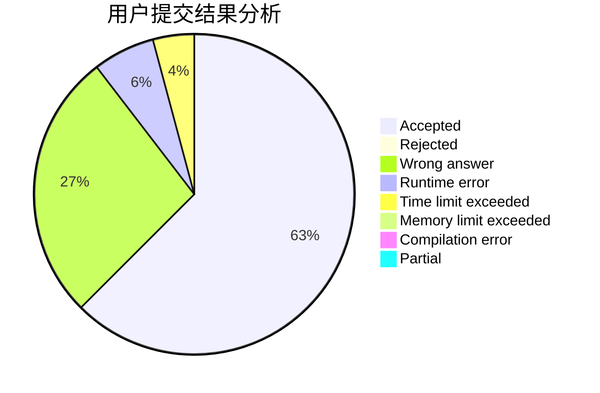
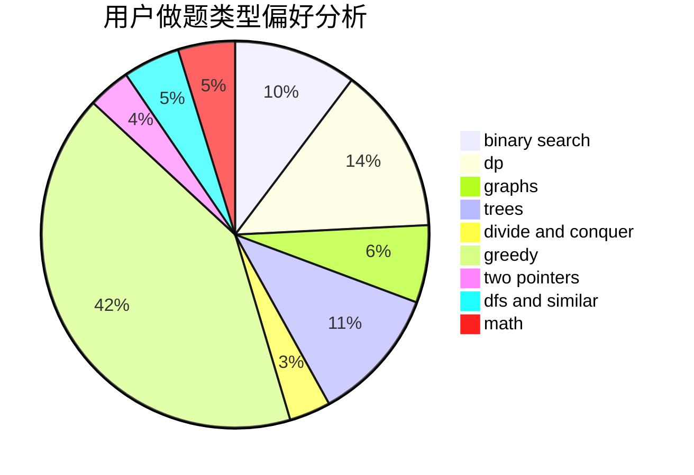

# BearChild_Chen

<!-- tabs:start -->

#### **用户提交结果分析**

#### **用户做题类型偏好分析**

<!-- tabs:end -->
# 推荐题目
[1406E](https://codeforces.com/contest/1406/problem/E)
[526A](https://codeforces.com/contest/526/problem/A)
[527C](https://codeforces.com/contest/527/problem/C)
[176B](https://codeforces.com/contest/176/problem/B)
[1487F](https://codeforces.com/contest/1487/problem/F)
[14D](https://codeforces.com/contest/14/problem/D)
[218B](https://codeforces.com/contest/218/problem/B)
[1093G](https://codeforces.com/contest/1093/problem/G)
[1028A](https://codeforces.com/contest/1028/problem/A)
[1195C](https://codeforces.com/contest/1195/problem/C)
