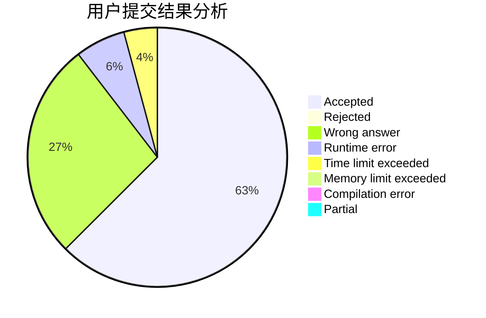
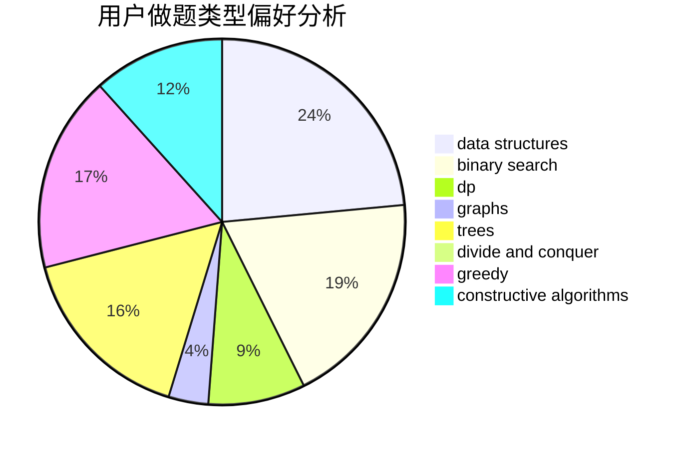
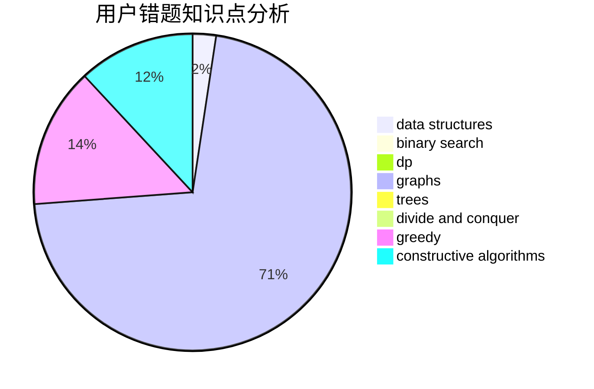

# BearChild_Chen

<!-- tabs:start -->

#### **用户提交结果分析**

#### **用户做题类型偏好分析**

#### **用户错题知识点分析**

<!-- tabs:end -->
# 推荐题目
[1406E](https://codeforces.com/contest/1406/problem/E)		interactive,
                        math,
                        number theory		  
[526A](https://codeforces.com/contest/526/problem/A)		brute force,
                        implementation		  
[527C](https://codeforces.com/contest/527/problem/C)		binary search,
                        data structures,
                        implementation		  
[176B](https://codeforces.com/contest/176/problem/B)		dp		  
[1487F](https://codeforces.com/contest/1487/problem/F)		dp,
                        greedy,
                        shortest paths		  
[14D](https://codeforces.com/contest/14/problem/D)		dfs and similar,
                        dp,
                        graphs,
                        shortest paths,
                        trees,
                        two pointers		  
[218B](https://codeforces.com/contest/218/problem/B)		implementation		  
[1093G](https://codeforces.com/contest/1093/problem/G)		bitmasks,
                        data structures		  
[1028A](https://codeforces.com/contest/1028/problem/A)		implementation		  
[1195C](https://codeforces.com/contest/1195/problem/C)		dp		  
