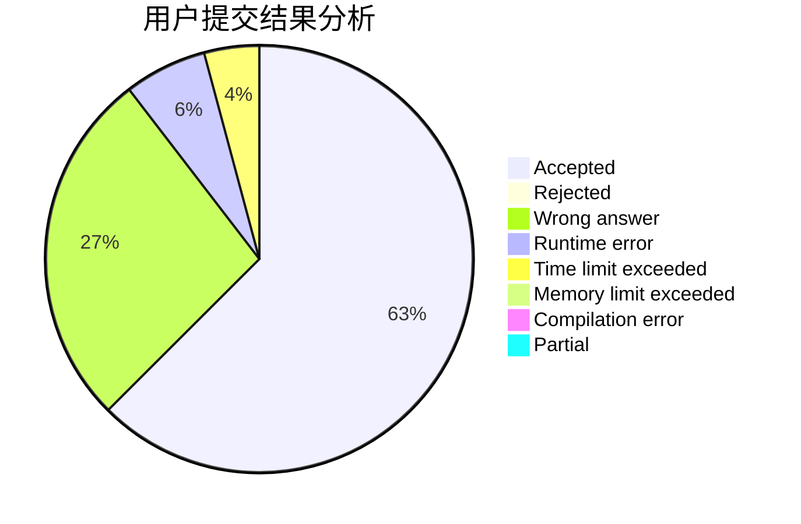
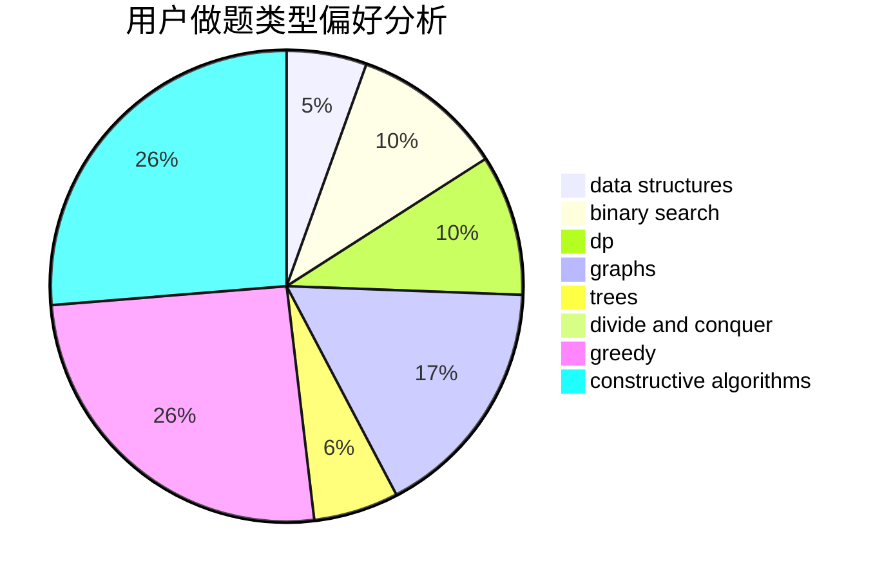
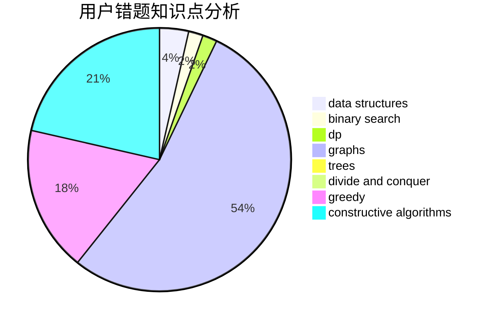

# BearChild_Chen

<!-- tabs:start -->

#### **用户提交结果分析**

#### **用户做题类型偏好分析**

#### **用户错题知识点分析**

<!-- tabs:end -->
# 推荐题目
[1398A](https://codeforces.com/contest/1398/problem/A)		geometry,
                        math		  
[505D](https://codeforces.com/contest/505/problem/D)		dfs and similar		  
[507B](https://codeforces.com/contest/507/problem/B)		geometry,
                        math		  
[154C](https://codeforces.com/contest/154/problem/C)		graphs,
                        hashing,
                        sortings		  
[1479B1](https://codeforces.com/contest/1479B/problem/1)		constructive algorithms,
                        data structures,
                        dp,
                        greedy,
                        implementation		  
[1491G](https://codeforces.com/contest/1491/problem/G)		constructive algorithms,
                        graphs,
                        math		  
[195B](https://codeforces.com/contest/195/problem/B)		data structures,
                        implementation,
                        math		  
[1093D](https://codeforces.com/contest/1093/problem/D)		dfs and similar,
                        graphs		  
[1027E](https://codeforces.com/contest/1027/problem/E)		combinatorics,
                        dp,
                        math		  
[118C](https://codeforces.com/contest/118/problem/C)		brute force,
                        greedy,
                        sortings,
                        strings		  
