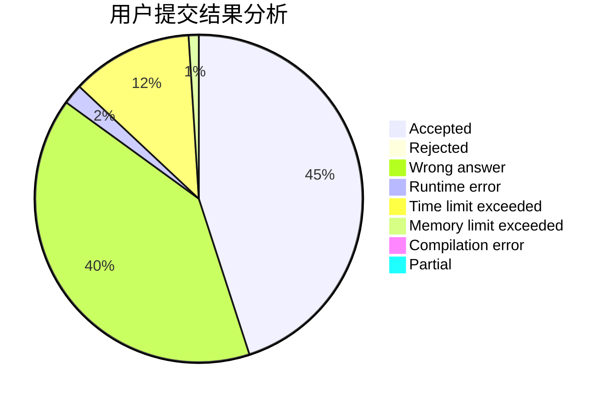
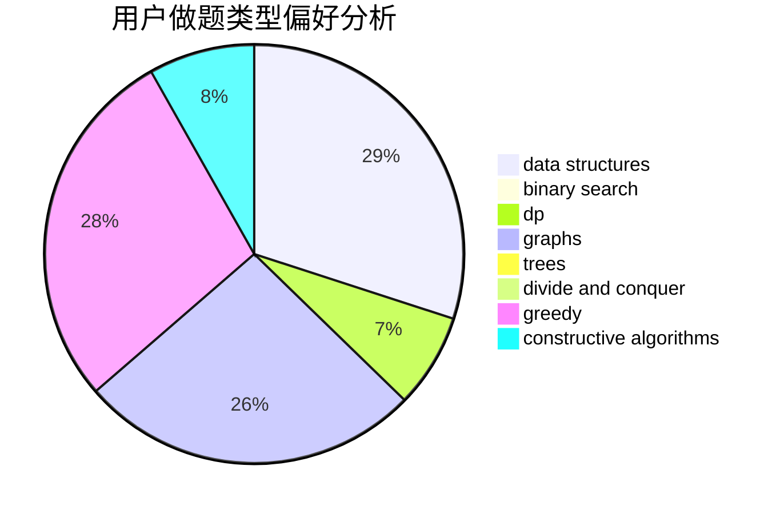
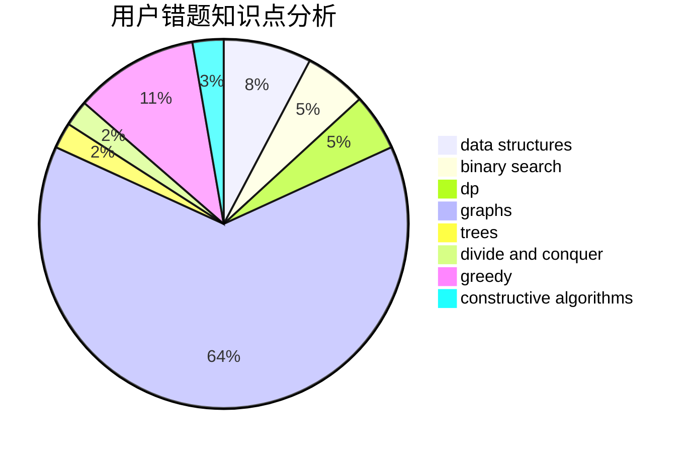

# iwriaw

<!-- tabs:start -->

#### **用户提交结果分析**

#### **用户做题类型偏好分析**

#### **用户错题知识点分析**

<!-- tabs:end -->
# 推荐题目
[497D](https://codeforces.com/contest/497/problem/D)		brute force,
                        geometry,
                        math		  
[928B](https://codeforces.com/contest/928/problem/B)		*special problem,
                        dp		  
[94C](https://codeforces.com/contest/94/problem/C)		dsu,graphs,sortings,trees		  
[939E](https://codeforces.com/contest/939/problem/E)		binary search,
                        greedy,
                        ternary search,
                        two pointers		  
[947E](https://codeforces.com/contest/947/problem/E)		dsu,graphs,sortings,trees		  
[339B](https://codeforces.com/contest/339/problem/B)		implementation		  
[172A](https://codeforces.com/contest/172/problem/A)		*special problem,
                        brute force,
                        implementation		  
[1067D](https://codeforces.com/contest/1067/problem/D)		dp,
                        greedy,
                        math,
                        probabilities		  
[1208F](https://codeforces.com/contest/1208/problem/F)		bitmasks,
                        dfs and similar,
                        dp,
                        greedy		  
[782D](https://codeforces.com/contest/782/problem/D)		dsu,graphs,sortings,trees		  
