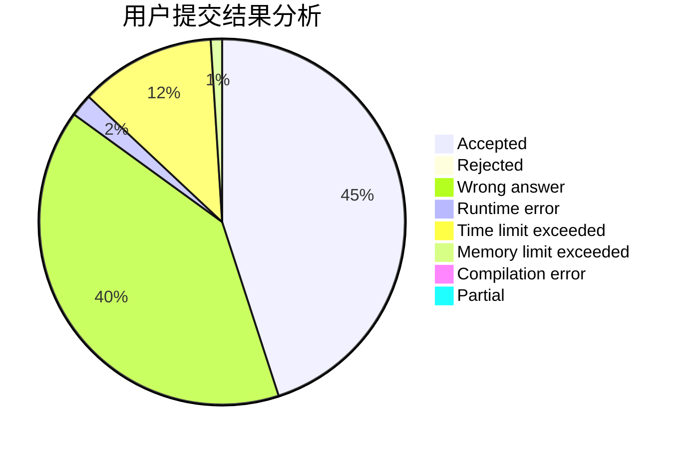
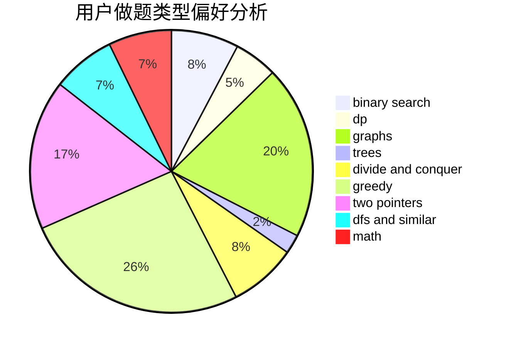

# iwriaw

<!-- tabs:start -->

#### **用户提交结果分析**

#### **用户做题类型偏好分析**

<!-- tabs:end -->
# 推荐题目
[497D](https://codeforces.com/contest/497/problem/D)
[928B](https://codeforces.com/contest/928/problem/B)
[94C](https://codeforces.com/contest/94/problem/C)
[939E](https://codeforces.com/contest/939/problem/E)
[947E](https://codeforces.com/contest/947/problem/E)
[339B](https://codeforces.com/contest/339/problem/B)
[172A](https://codeforces.com/contest/172/problem/A)
[1067D](https://codeforces.com/contest/1067/problem/D)
[1208F](https://codeforces.com/contest/1208/problem/F)
[782D](https://codeforces.com/contest/782/problem/D)
