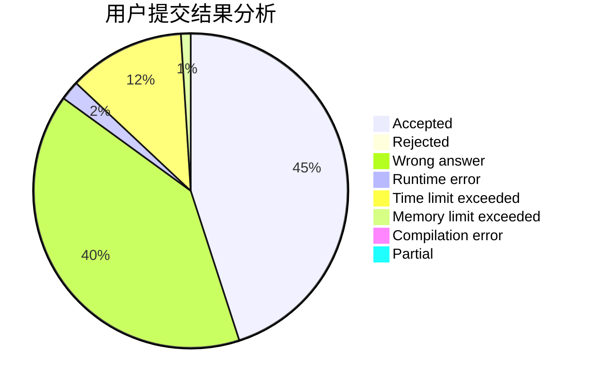
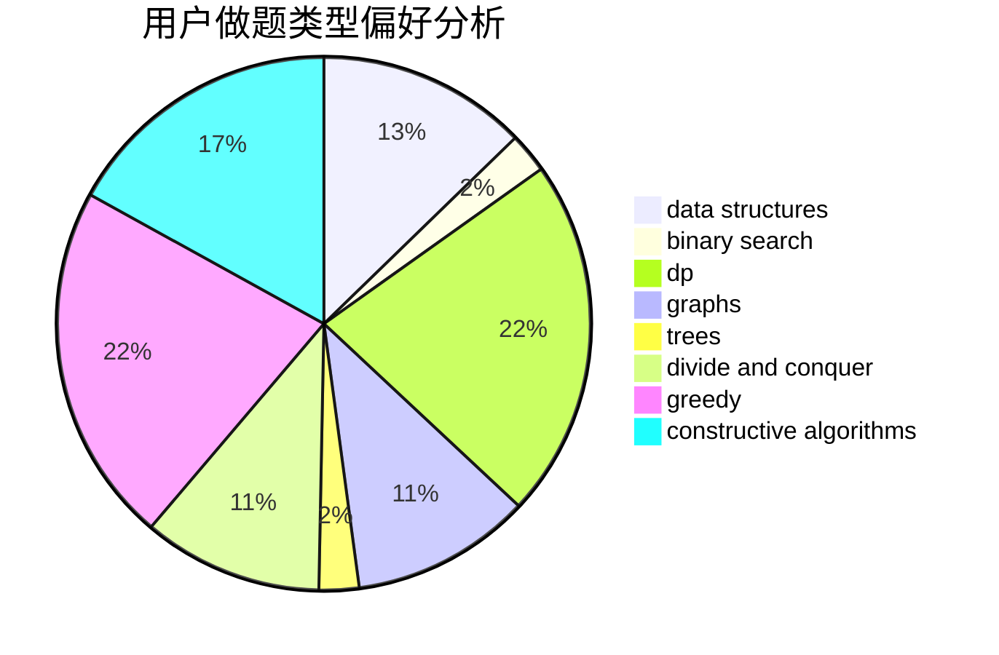
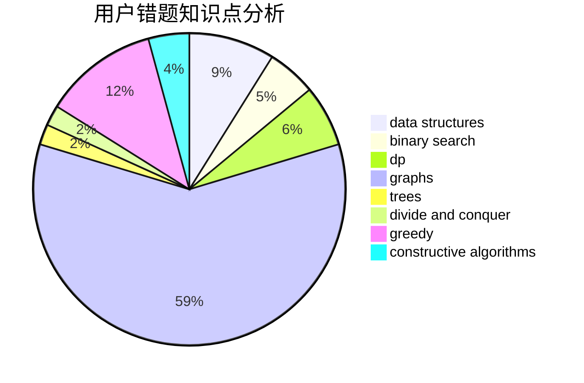

# iwriaw

<!-- tabs:start -->

#### **用户提交结果分析**

#### **用户做题类型偏好分析**

#### **用户错题知识点分析**

<!-- tabs:end -->
# 推荐题目
[477D](https://codeforces.com/contest/477/problem/D)		dp,
                        strings		  
[911C](https://codeforces.com/contest/911/problem/C)		brute force,
                        constructive algorithms		  
[930A](https://codeforces.com/contest/930/problem/A)		dfs and similar,
                        graphs,
                        trees		  
[919D](https://codeforces.com/contest/919/problem/D)		dfs and similar,
                        dp,
                        graphs		  
[924B](https://codeforces.com/contest/924/problem/B)		binary search,
                        greedy,
                        two pointers		  
[314C](https://codeforces.com/contest/314/problem/C)		data structures,
                        dp		  
[1513B](https://codeforces.com/contest/1513/problem/B)		bitmasks,
                        combinatorics,
                        constructive algorithms,
                        math		  
[1067A](https://codeforces.com/contest/1067/problem/A)		dp		  
[1204A](https://codeforces.com/contest/1204/problem/A)		math		  
[764A](https://codeforces.com/contest/764/problem/A)		brute force,
                        implementation,
                        math		  
