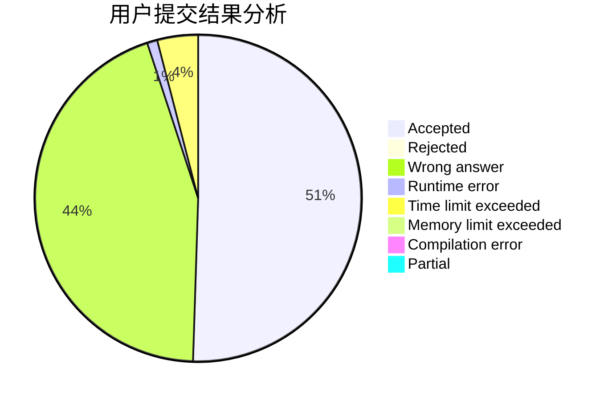
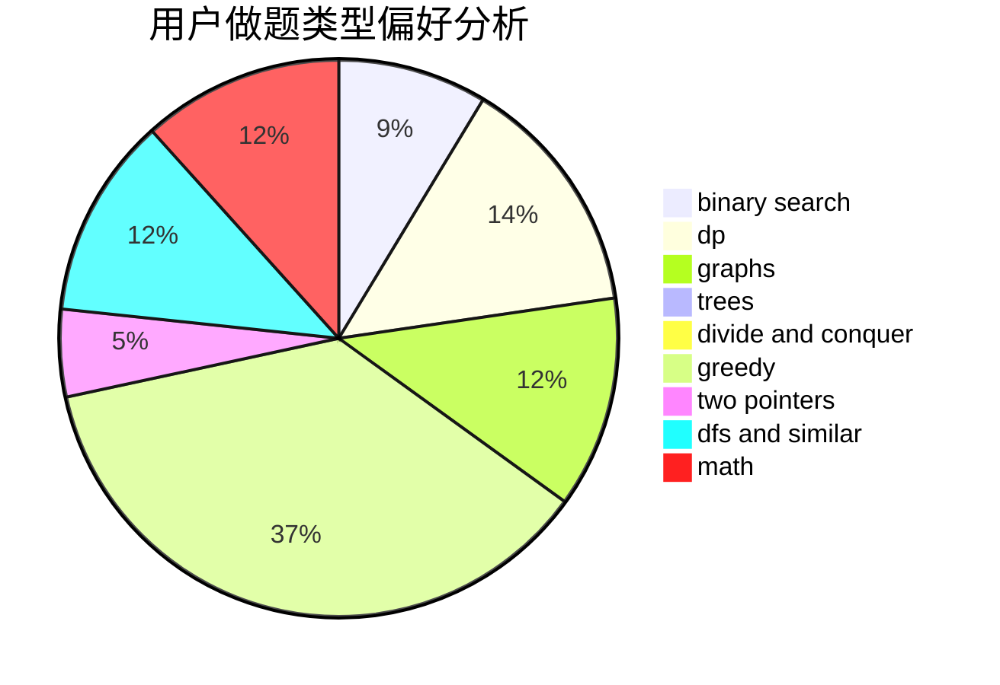

# ix35

<!-- tabs:start -->

#### **用户提交结果分析**

#### **用户做题类型偏好分析**

<!-- tabs:end -->
# 推荐题目
[1036B](https://codeforces.com/contest/1036/problem/B)
[928B](https://codeforces.com/contest/928/problem/B)
[689A](https://codeforces.com/contest/689/problem/A)
[1058D](https://codeforces.com/contest/1058/problem/D)
[38C](https://codeforces.com/contest/38/problem/C)
[876F](https://codeforces.com/contest/876/problem/F)
[1298C](https://codeforces.com/contest/1298/problem/C)
[1240E](https://codeforces.com/contest/1240/problem/E)
[714B](https://codeforces.com/contest/714/problem/B)
[659D](https://codeforces.com/contest/659/problem/D)
