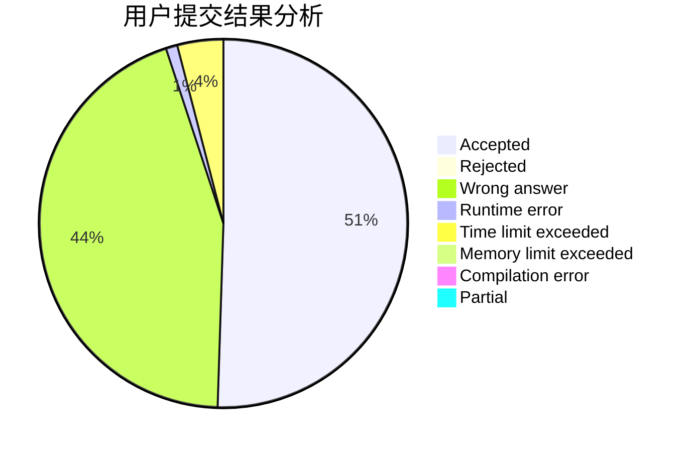
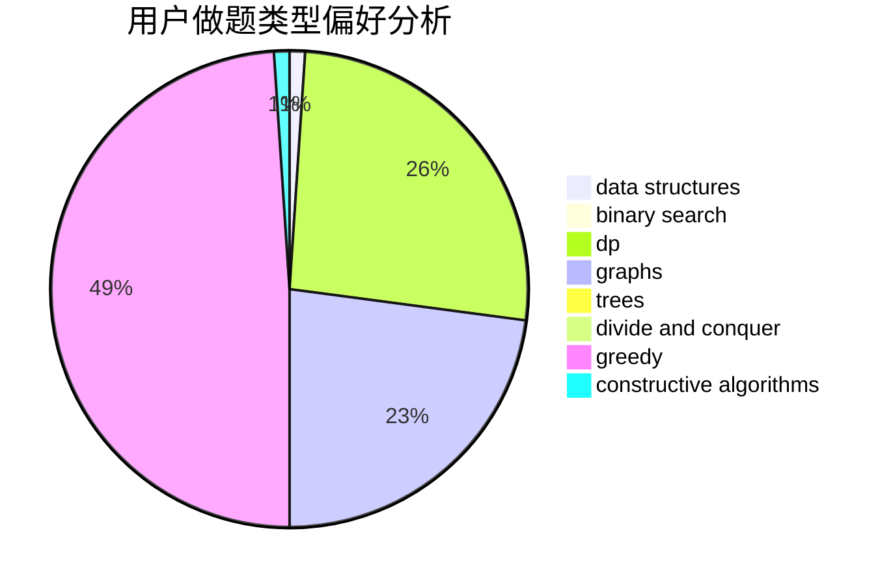

# ix35

<!-- tabs:start -->

#### **用户提交结果分析**

#### **用户做题类型偏好分析**

#### **用户错题知识点分析**

<!-- tabs:end -->
# 推荐题目
[1036B](https://codeforces.com/contest/1036/problem/B)		math		  
[928B](https://codeforces.com/contest/928/problem/B)		*special problem,
                        dp		  
[689A](https://codeforces.com/contest/689/problem/A)		brute force,
                        constructive algorithms,
                        implementation		  
[1058D](https://codeforces.com/contest/1058/problem/D)		dsu,graphs,sortings,trees		  
[38C](https://codeforces.com/contest/38/problem/C)		brute force		  
[876F](https://codeforces.com/contest/876/problem/F)		dsu,graphs,sortings,trees		  
[1298C](https://codeforces.com/contest/1298/problem/C)		dsu,graphs,sortings,trees		  
[1240E](https://codeforces.com/contest/1240/problem/E)		dsu,graphs,sortings,trees		  
[714B](https://codeforces.com/contest/714/problem/B)		implementation,
                        sortings		  
[659D](https://codeforces.com/contest/659/problem/D)		geometry,
                        implementation,
                        math		  
