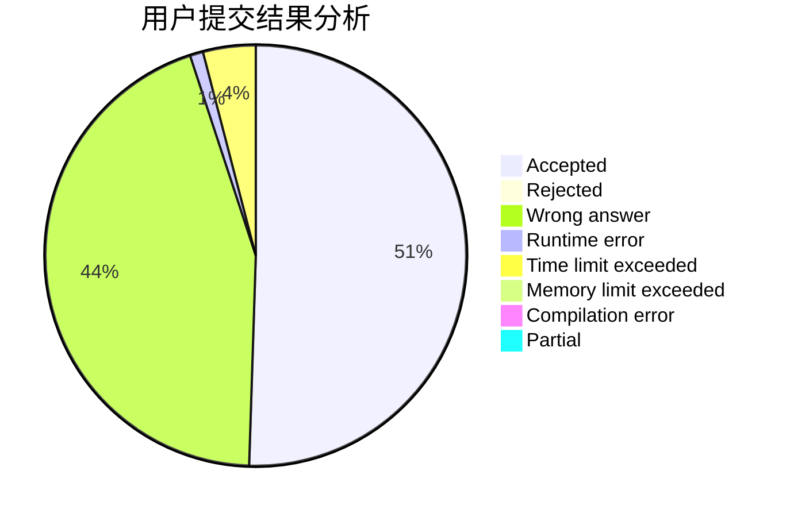
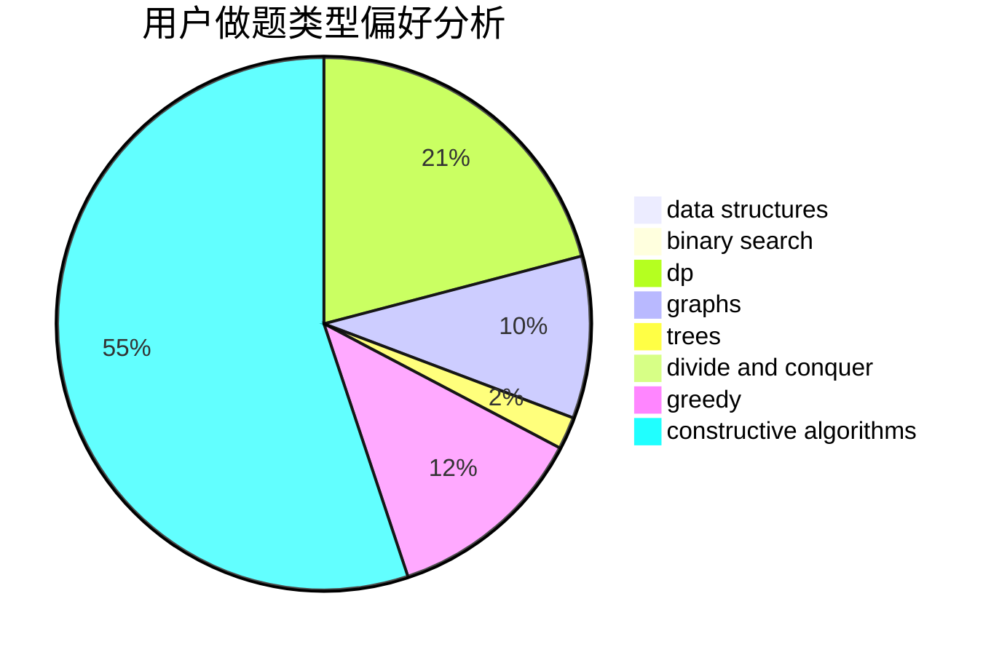

# ix35

<!-- tabs:start -->

#### **用户提交结果分析**

#### **用户做题类型偏好分析**

#### **用户错题知识点分析**

<!-- tabs:end -->
# 推荐题目
[1034D](https://codeforces.com/contest/1034/problem/D)		binary search,
                        data structures,
                        two pointers		  
[911C](https://codeforces.com/contest/911/problem/C)		brute force,
                        constructive algorithms		  
[667A](https://codeforces.com/contest/667/problem/A)		geometry,
                        math		  
[1058A](https://codeforces.com/contest/1058/problem/A)		dsu,graphs,sortings,trees		  
[363D](https://codeforces.com/contest/363/problem/D)		binary search,
                        greedy		  
[859B](https://codeforces.com/contest/859/problem/B)		brute force,
                        geometry,
                        math		  
[1291D](https://codeforces.com/contest/1291/problem/D)		dsu,graphs,sortings,trees		  
[1236B](https://codeforces.com/contest/1236/problem/B)		combinatorics,
                        math		  
[698A](https://codeforces.com/contest/698/problem/A)		dp		  
[629D](https://codeforces.com/contest/629/problem/D)		data structures,
                        dp		  
