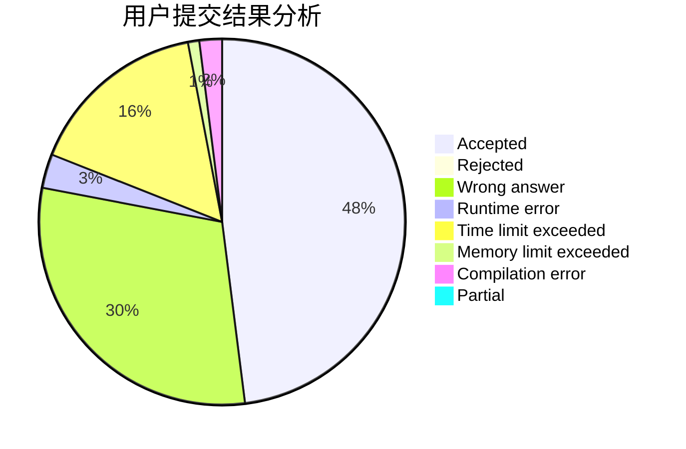
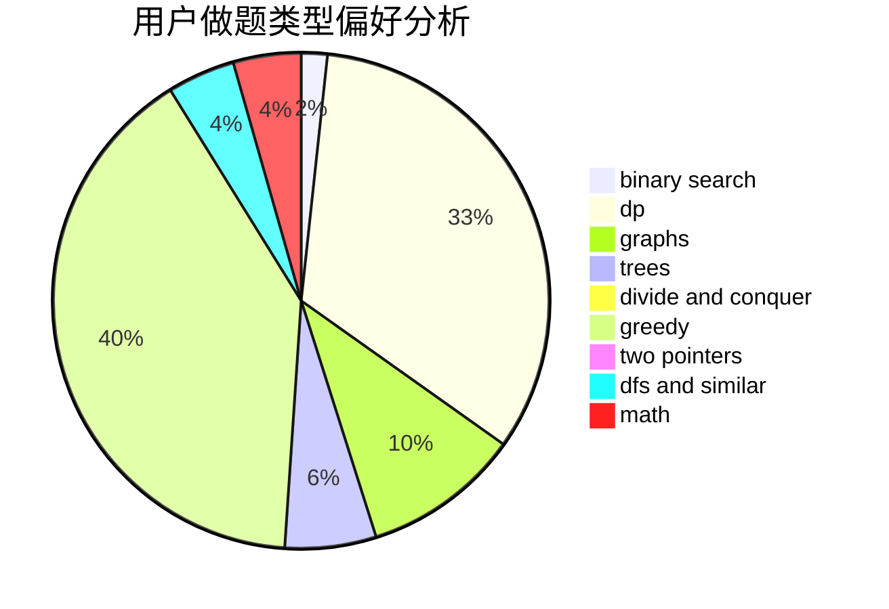

# iynaur87

<!-- tabs:start -->

#### **用户提交结果分析**

#### **用户做题类型偏好分析**

<!-- tabs:end -->
# 推荐题目
[1209D](https://codeforces.com/contest/1209/problem/D)
[25A](https://codeforces.com/contest/25/problem/A)
[781F](https://codeforces.com/contest/781/problem/F)
[734D](https://codeforces.com/contest/734/problem/D)
[377C](https://codeforces.com/contest/377/problem/C)
[918A](https://codeforces.com/contest/918/problem/A)
[635E](https://codeforces.com/contest/635/problem/E)
[1132G](https://codeforces.com/contest/1132/problem/G)
[810E](https://codeforces.com/contest/810/problem/E)
[821D](https://codeforces.com/contest/821/problem/D)
