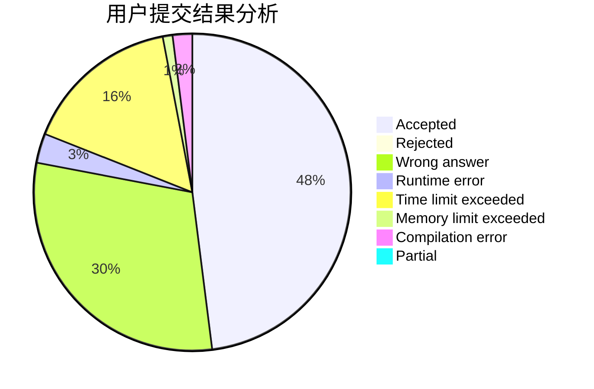
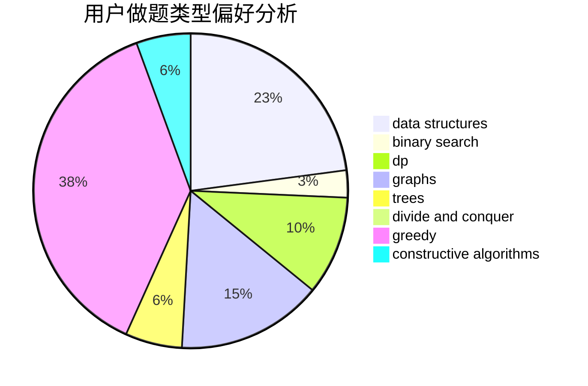
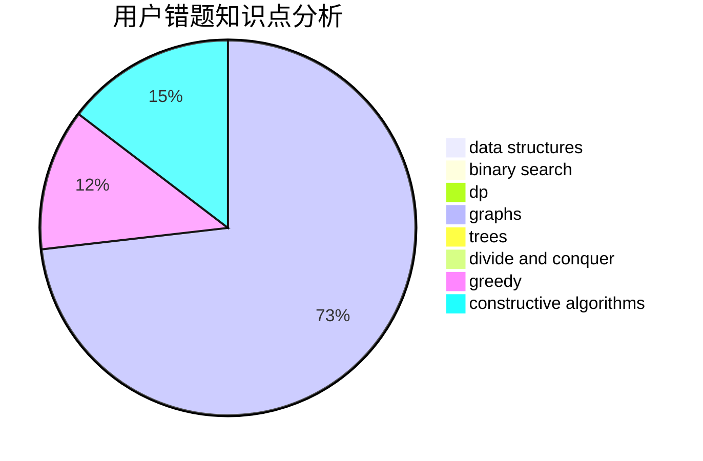

# iynaur87

<!-- tabs:start -->

#### **用户提交结果分析**

#### **用户做题类型偏好分析**

#### **用户错题知识点分析**

<!-- tabs:end -->
# 推荐题目
[1209D](https://codeforces.com/contest/1209/problem/D)		dfs and similar,
                        dsu,
                        graphs		  
[25A](https://codeforces.com/contest/25/problem/A)		brute force		  
[781F](https://codeforces.com/contest/781/problem/F)		dsu,graphs,sortings,trees		  
[734D](https://codeforces.com/contest/734/problem/D)		implementation		  
[377C](https://codeforces.com/contest/377/problem/C)		bitmasks,
                        dp,
                        games		  
[918A](https://codeforces.com/contest/918/problem/A)		brute force,
                        implementation		  
[635E](https://codeforces.com/contest/635/problem/E)		dsu,graphs,sortings,trees		  
[1132G](https://codeforces.com/contest/1132/problem/G)		data structures,
                        dp,
                        trees		  
[810E](https://codeforces.com/contest/810/problem/E)		dsu,graphs,sortings,trees		  
[821D](https://codeforces.com/contest/821/problem/D)		dfs and similar,
                        graphs,
                        shortest paths		  
