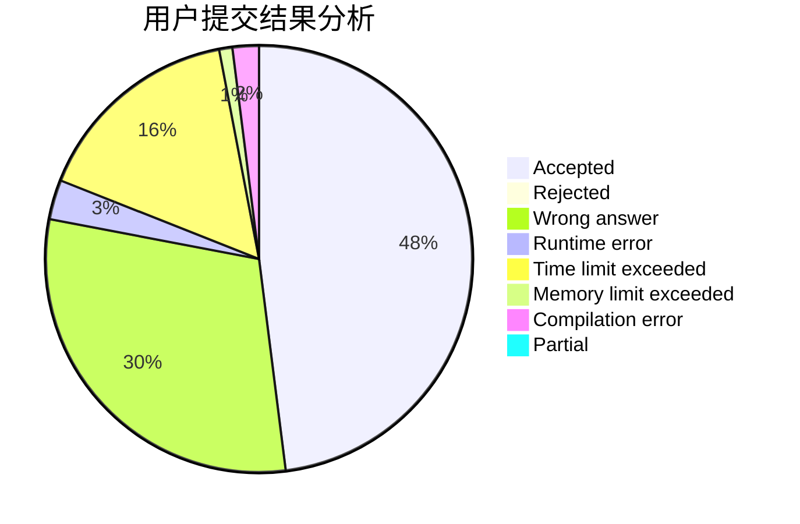
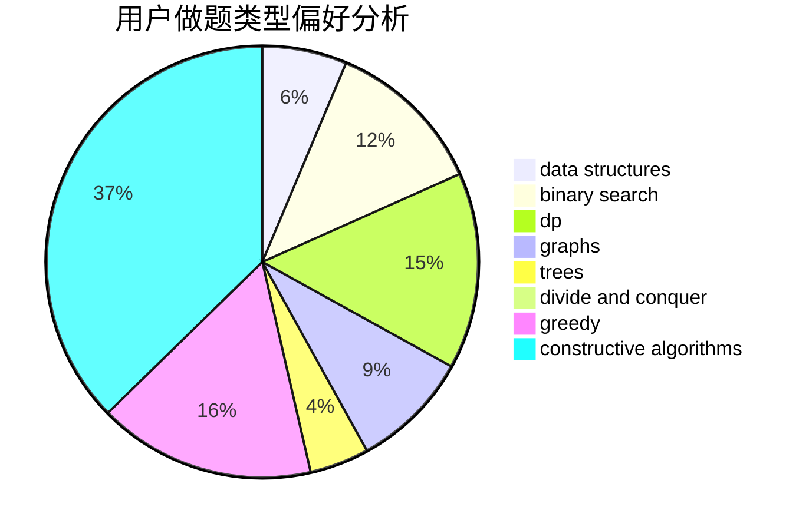
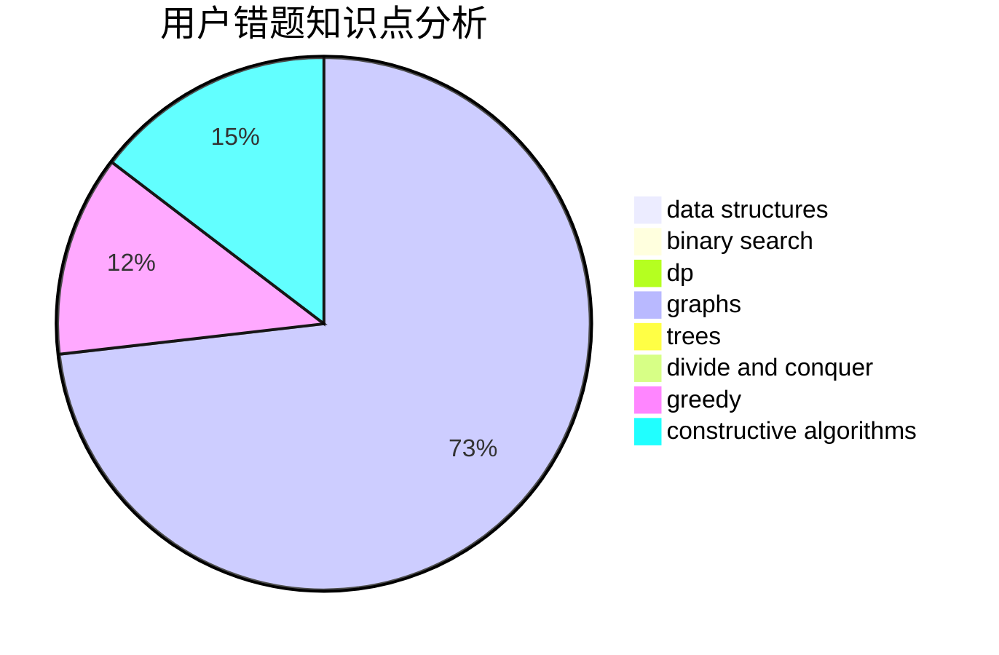

# iynaur87

<!-- tabs:start -->

#### **用户提交结果分析**

#### **用户做题类型偏好分析**

#### **用户错题知识点分析**

<!-- tabs:end -->
# 推荐题目
[1205B](https://codeforces.com/contest/1205/problem/B)		bitmasks,
                        brute force,
                        graphs,
                        shortest paths		  
[236D](https://codeforces.com/contest/236/problem/D)		dsu,graphs,sortings,trees		  
[763B](https://codeforces.com/contest/763/problem/B)		constructive algorithms,
                        geometry		  
[717A](https://codeforces.com/contest/717/problem/A)		math,
                        number theory		  
[350B](https://codeforces.com/contest/350/problem/B)		graphs		  
[901C](https://codeforces.com/contest/901/problem/C)		binary search,
                        data structures,
                        dfs and similar,
                        dsu,
                        graphs,
                        two pointers		  
[617E](https://codeforces.com/contest/617/problem/E)		data structures		  
[1131A](https://codeforces.com/contest/1131/problem/A)		math		  
[796D](https://codeforces.com/contest/796/problem/D)		constructive algorithms,
                        dfs and similar,
                        dp,
                        graphs,
                        shortest paths,
                        trees		  
[805C](https://codeforces.com/contest/805/problem/C)		dsu,graphs,sortings,trees		  
