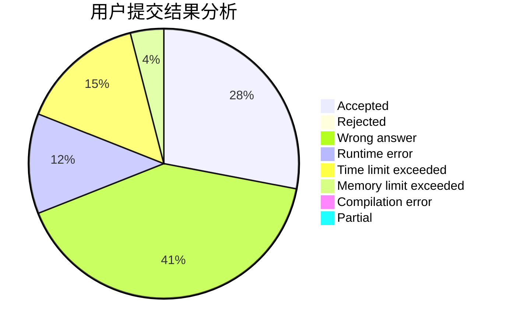
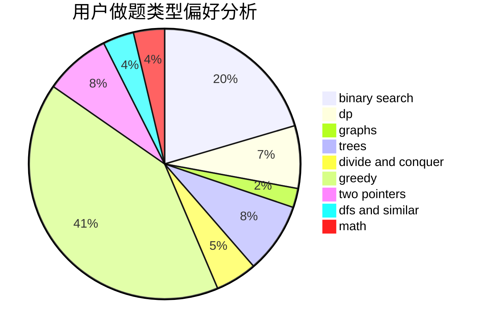

# iyua

<!-- tabs:start -->

#### **用户提交结果分析**

#### **用户做题类型偏好分析**

<!-- tabs:end -->
# 推荐题目
[1494B](https://codeforces.com/contest/1494/problem/B)
[1474B](https://codeforces.com/contest/1474/problem/B)
[292A](https://codeforces.com/contest/292/problem/A)
[13541](https://codeforces.com/contest/1354/problem/1)
[1013E](https://codeforces.com/contest/1013/problem/E)
[668D](https://codeforces.com/contest/668/problem/D)
[11302](https://codeforces.com/contest/1130/problem/2)
[124A](https://codeforces.com/contest/124/problem/A)
[852D](https://codeforces.com/contest/852/problem/D)
[260E](https://codeforces.com/contest/260/problem/E)
