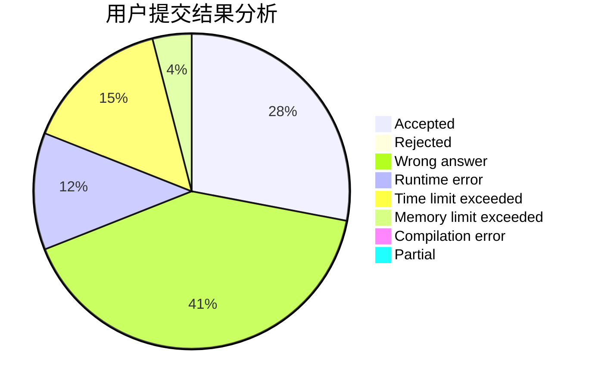
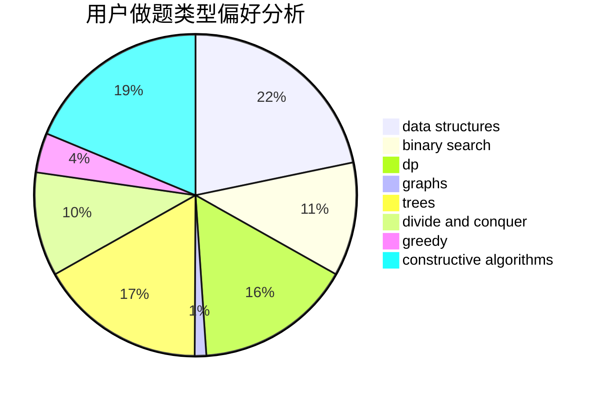

# iyua

<!-- tabs:start -->

#### **用户提交结果分析**

#### **用户做题类型偏好分析**

#### **用户错题知识点分析**

<!-- tabs:end -->
# 推荐题目
[1494B](https://codeforces.com/contest/1494/problem/B)		bitmasks,
                        brute force,
                        greedy,
                        implementation		  
[1474B](https://codeforces.com/contest/1474/problem/B)		binary search,
                        constructive algorithms,
                        greedy,
                        math,
                        number theory		  
[292A](https://codeforces.com/contest/292/problem/A)		implementation		  
[13541](https://codeforces.com/contest/1354/problem/1)		dsu,graphs,sortings,trees		  
[1013E](https://codeforces.com/contest/1013/problem/E)		dsu,graphs,sortings,trees		  
[668D](https://codeforces.com/contest/668/problem/D)		dsu,graphs,sortings,trees		  
[11302](https://codeforces.com/contest/1130/problem/2)		dsu,graphs,sortings,trees		  
[124A](https://codeforces.com/contest/124/problem/A)		math		  
[852D](https://codeforces.com/contest/852/problem/D)		binary search,
                        flows,
                        graph matchings,
                        shortest paths		  
[260E](https://codeforces.com/contest/260/problem/E)		binary search,
                        brute force,
                        data structures		  
