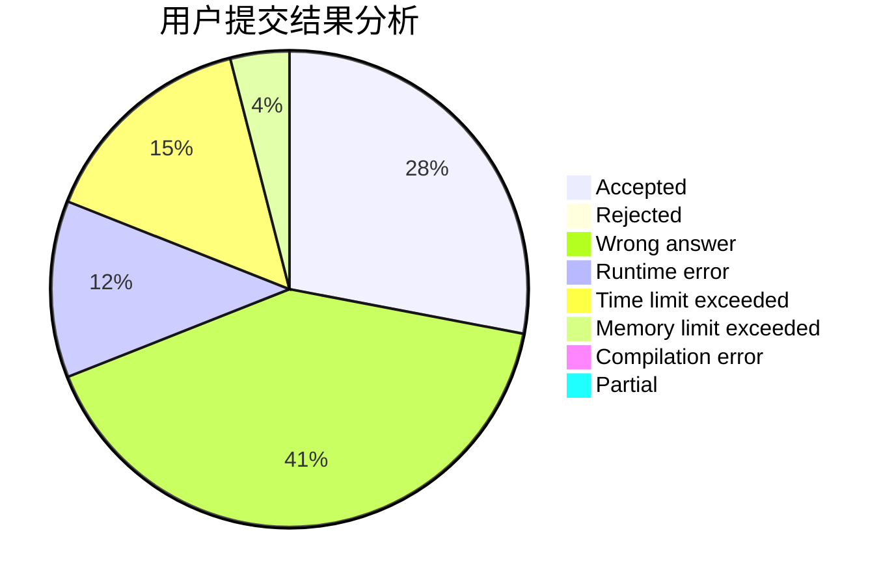
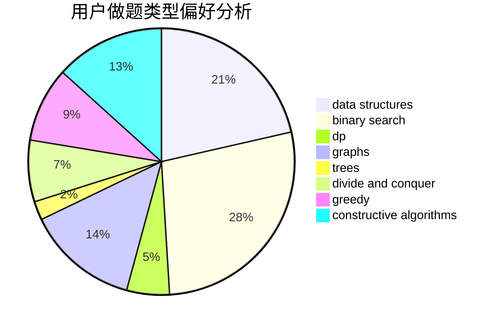

# iyua

<!-- tabs:start -->

#### **用户提交结果分析**

#### **用户做题类型偏好分析**

#### **用户错题知识点分析**

<!-- tabs:end -->
# 推荐题目
[1486E](https://codeforces.com/contest/1486/problem/E)		binary search,
                        brute force,
                        constructive algorithms,
                        dp,
                        flows,
                        graphs,
                        shortest paths		  
[1466I](https://codeforces.com/contest/1466/problem/I)		binary search,
                        data structures,
                        data structures,
                        interactive		  
[277B](https://codeforces.com/contest/277/problem/B)		constructive algorithms,
                        geometry		  
[1346F](https://codeforces.com/contest/1346/problem/F)		*special problem,
                        data structures,
                        greedy,
                        math		  
[1013B](https://codeforces.com/contest/1013/problem/B)		greedy		  
[639B](https://codeforces.com/contest/639/problem/B)		constructive algorithms,
                        graphs,
                        trees		  
[1120F](https://codeforces.com/contest/1120/problem/F)		data structures,
                        dp,
                        greedy		  
[1244E](https://codeforces.com/contest/1244/problem/E)		binary search,
                        constructive algorithms,
                        greedy,
                        sortings,
                        ternary search,
                        two pointers		  
[834C](https://codeforces.com/contest/834/problem/C)		dsu,graphs,sortings,trees		  
[23C](https://codeforces.com/contest/23/problem/C)		constructive algorithms,
                        sortings		  
