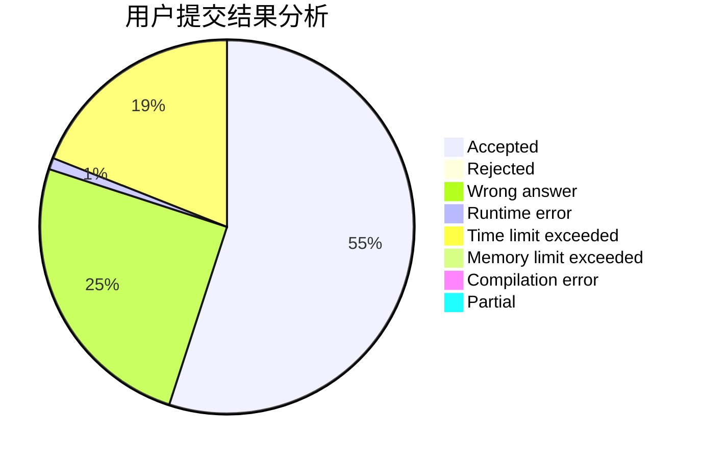
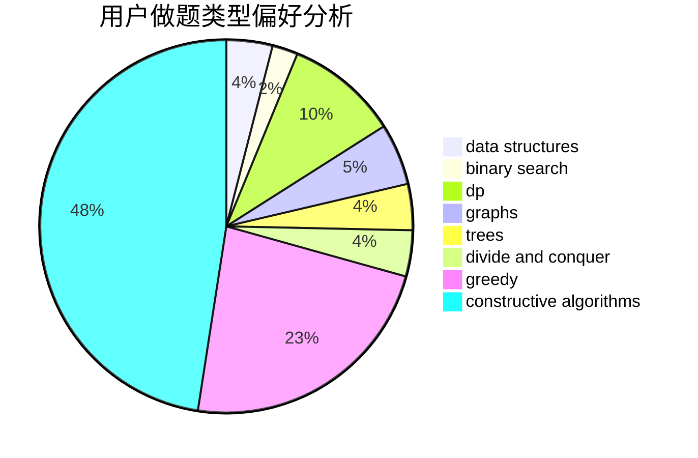
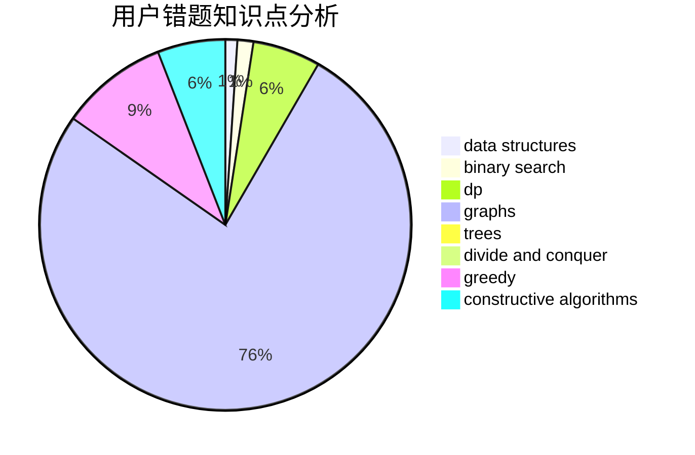

# izlyforever

<!-- tabs:start -->

#### **用户提交结果分析**

#### **用户做题类型偏好分析**

#### **用户错题知识点分析**

<!-- tabs:end -->
# 推荐题目
[345A](https://codeforces.com/contest/345/problem/A)		*special problem,
                        probabilities		  
[212A](https://codeforces.com/contest/212/problem/A)		flows,
                        graphs		  
[165C](https://codeforces.com/contest/165/problem/C)		binary search,
                        brute force,
                        dp,
                        math,
                        strings,
                        two pointers		  
[950B](https://codeforces.com/contest/950/problem/B)		greedy,
                        implementation		  
[1120F](https://codeforces.com/contest/1120/problem/F)		data structures,
                        dp,
                        greedy		  
[617B](https://codeforces.com/contest/617/problem/B)		combinatorics		  
[1323B](https://codeforces.com/contest/1323/problem/B)		binary search,
                        greedy,
                        implementation		  
[520B](https://codeforces.com/contest/520/problem/B)		dfs and similar,
                        graphs,
                        greedy,
                        implementation,
                        math,
                        shortest paths		  
[513F2](https://codeforces.com/contest/513F/problem/2)		flows		  
[1321F](https://codeforces.com/contest/1321/problem/F)		dsu,graphs,sortings,trees		  
