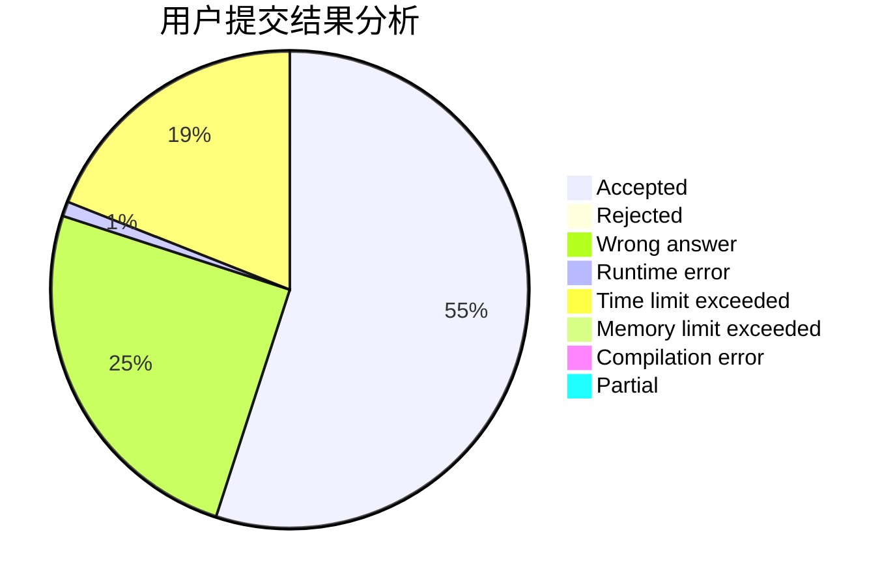
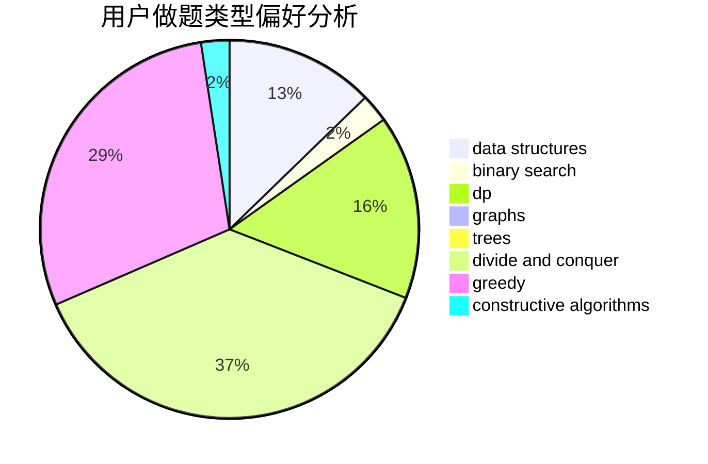
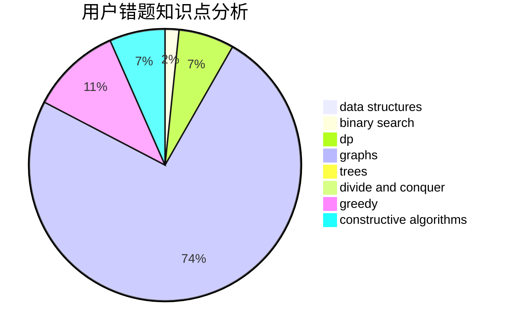

# izlyforever

<!-- tabs:start -->

#### **用户提交结果分析**

#### **用户做题类型偏好分析**

#### **用户错题知识点分析**

<!-- tabs:end -->
# 推荐题目
[371C](https://codeforces.com/contest/371/problem/C)		binary search,
                        brute force		  
[232A](https://codeforces.com/contest/232/problem/A)		binary search,
                        constructive algorithms,
                        graphs,
                        greedy		  
[18E](https://codeforces.com/contest/18/problem/E)		dp		  
[967D](https://codeforces.com/contest/967/problem/D)		dsu,graphs,sortings,trees		  
[11302](https://codeforces.com/contest/1130/problem/2)		dsu,graphs,sortings,trees		  
[635A](https://codeforces.com/contest/635/problem/A)		brute force,
                        implementation		  
[132E](https://codeforces.com/contest/132/problem/E)		flows,
                        graphs		  
[546A](https://codeforces.com/contest/546/problem/A)		brute force,
                        implementation,
                        math		  
[53A](https://codeforces.com/contest/53/problem/A)		implementation		  
[1328E](https://codeforces.com/contest/1328/problem/E)		dfs and similar,
                        graphs,
                        trees		  
