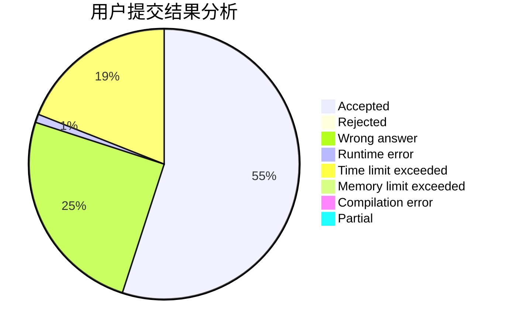
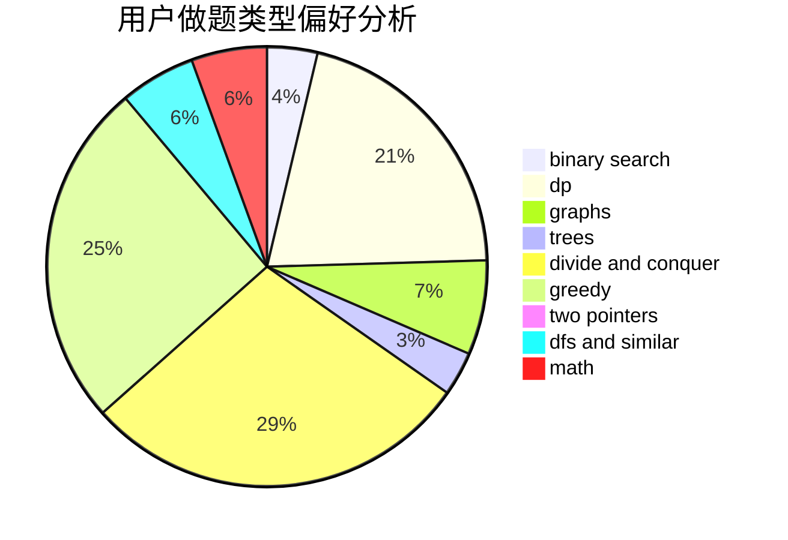

# izlyforever

<!-- tabs:start -->

#### **用户提交结果分析**

#### **用户做题类型偏好分析**

<!-- tabs:end -->
# 推荐题目
[371C](https://codeforces.com/contest/371/problem/C)
[232A](https://codeforces.com/contest/232/problem/A)
[18E](https://codeforces.com/contest/18/problem/E)
[967D](https://codeforces.com/contest/967/problem/D)
[11302](https://codeforces.com/contest/1130/problem/2)
[635A](https://codeforces.com/contest/635/problem/A)
[132E](https://codeforces.com/contest/132/problem/E)
[546A](https://codeforces.com/contest/546/problem/A)
[53A](https://codeforces.com/contest/53/problem/A)
[1328E](https://codeforces.com/contest/1328/problem/E)
