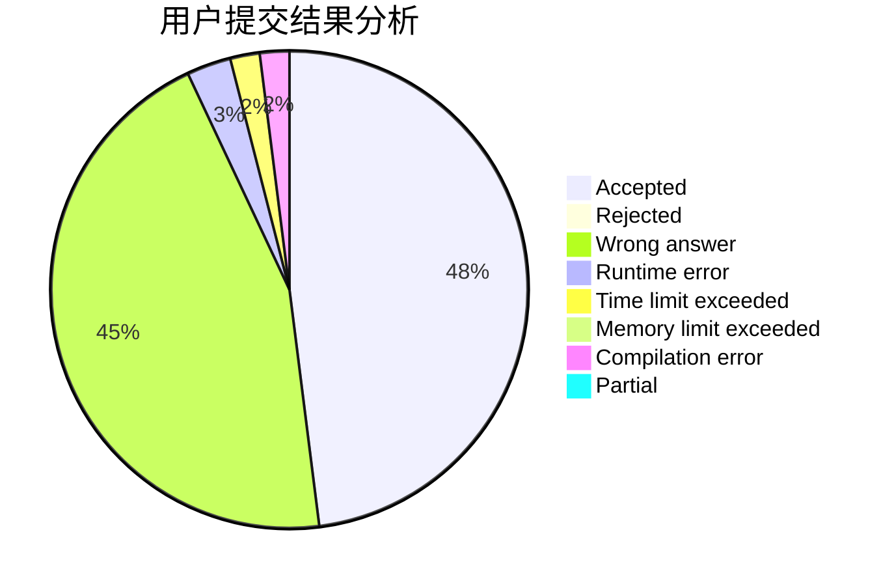
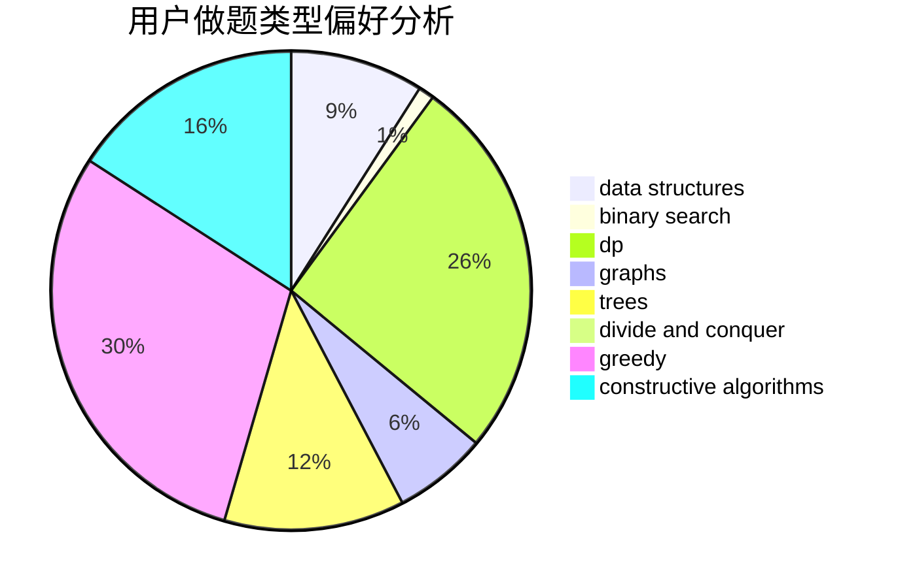

# izumiQR

<!-- tabs:start -->

#### **用户提交结果分析**

#### **用户做题类型偏好分析**

#### **用户错题知识点分析**

<!-- tabs:end -->
# 推荐题目
[193C](https://codeforces.com/contest/193/problem/C)		constructive algorithms,
                        greedy,
                        math,
                        matrices		  
[520A](https://codeforces.com/contest/520/problem/A)		implementation,
                        strings		  
[16C](https://codeforces.com/contest/16/problem/C)		binary search,
                        number theory		  
[976B](https://codeforces.com/contest/976/problem/B)		implementation,
                        math		  
[145B](https://codeforces.com/contest/145/problem/B)		constructive algorithms		  
[1234F](https://codeforces.com/contest/1234/problem/F)		bitmasks,
                        dp		  
[449B](https://codeforces.com/contest/449/problem/B)		graphs,
                        greedy,
                        shortest paths		  
[1425E](https://codeforces.com/contest/1425/problem/E)		greedy,
                        implementation		  
[260B](https://codeforces.com/contest/260/problem/B)		brute force,
                        implementation,
                        strings		  
[95E](https://codeforces.com/contest/95/problem/E)		dp,
                        dsu,
                        graphs		  
