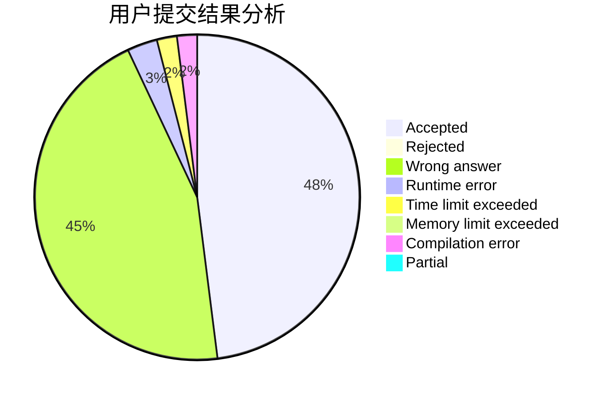
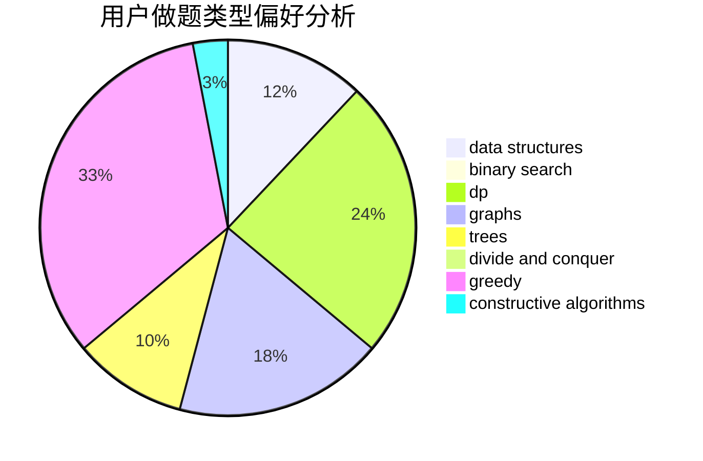

# izumiQR

<!-- tabs:start -->

#### **用户提交结果分析**

#### **用户做题类型偏好分析**

#### **用户错题知识点分析**

<!-- tabs:end -->
# 推荐题目
[167B](https://codeforces.com/contest/167/problem/B)		dp,
                        math,
                        probabilities		  
[4A](https://codeforces.com/contest/4/problem/A)		brute force,
                        math		  
[1511F](https://codeforces.com/contest/1511/problem/F)		brute force,
                        data structures,
                        dp,
                        matrices,
                        string suffix structures,
                        strings		  
[954C](https://codeforces.com/contest/954/problem/C)		implementation		  
[1451B](https://codeforces.com/contest/1451/problem/B)		dp,
                        greedy,
                        implementation,
                        strings		  
[1227B](https://codeforces.com/contest/1227/problem/B)		constructive algorithms		  
[425C](https://codeforces.com/contest/425/problem/C)		data structures,
                        dp		  
[1418A](https://codeforces.com/contest/1418/problem/A)		math		  
[238E](https://codeforces.com/contest/238/problem/E)		dp,
                        graphs,
                        shortest paths		  
[938D](https://codeforces.com/contest/938/problem/D)		data structures,
                        graphs,
                        shortest paths		  
