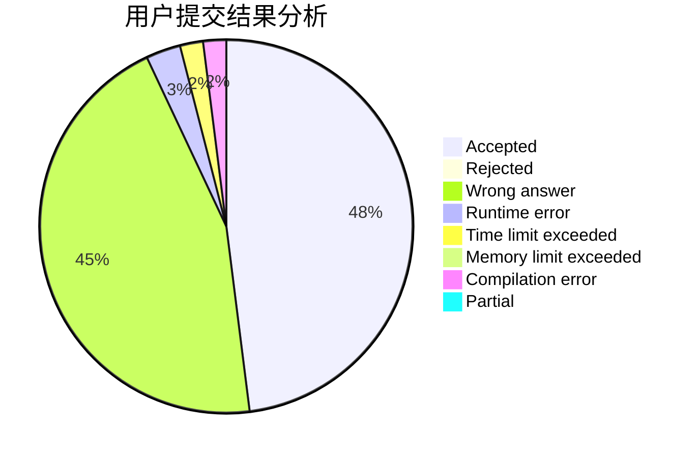
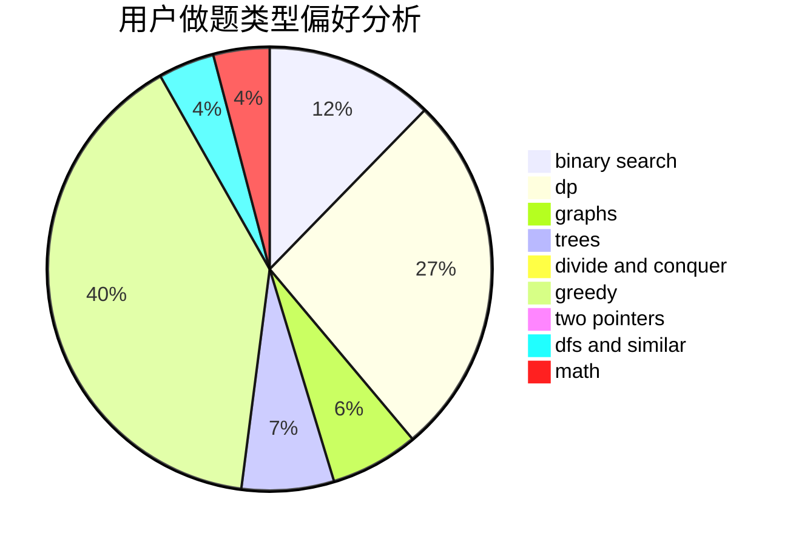

# izumiQR

<!-- tabs:start -->

#### **用户提交结果分析**

#### **用户做题类型偏好分析**

<!-- tabs:end -->
# 推荐题目
[193C](https://codeforces.com/contest/193/problem/C)
[520A](https://codeforces.com/contest/520/problem/A)
[16C](https://codeforces.com/contest/16/problem/C)
[976B](https://codeforces.com/contest/976/problem/B)
[145B](https://codeforces.com/contest/145/problem/B)
[1234F](https://codeforces.com/contest/1234/problem/F)
[449B](https://codeforces.com/contest/449/problem/B)
[1425E](https://codeforces.com/contest/1425/problem/E)
[260B](https://codeforces.com/contest/260/problem/B)
[95E](https://codeforces.com/contest/95/problem/E)
