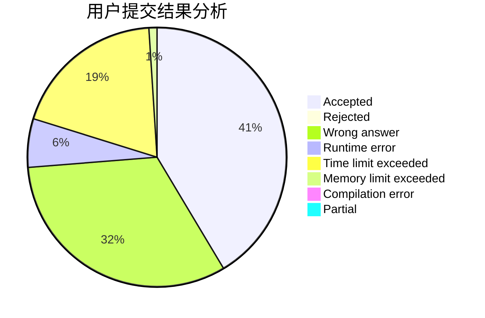
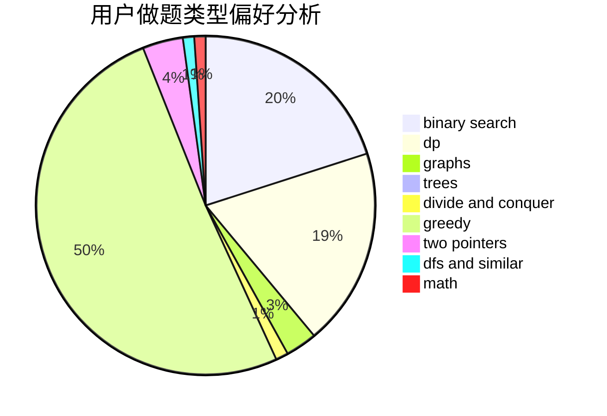

# jasonfan

<!-- tabs:start -->

#### **用户提交结果分析**

#### **用户做题类型偏好分析**

<!-- tabs:end -->
# 推荐题目
[1260C](https://codeforces.com/contest/1260/problem/C)
[1423K](https://codeforces.com/contest/1423/problem/K)
[1119B](https://codeforces.com/contest/1119/problem/B)
[348B](https://codeforces.com/contest/348/problem/B)
[388B](https://codeforces.com/contest/388/problem/B)
[421B](https://codeforces.com/contest/421/problem/B)
[865G](https://codeforces.com/contest/865/problem/G)
[1036B](https://codeforces.com/contest/1036/problem/B)
[282E](https://codeforces.com/contest/282/problem/E)
[870E](https://codeforces.com/contest/870/problem/E)
