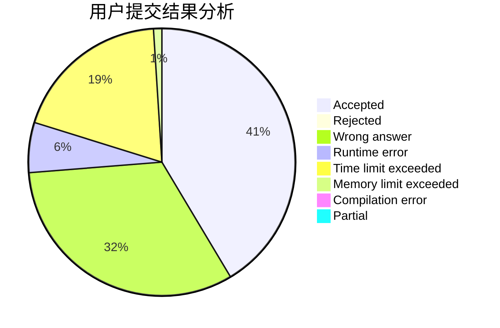
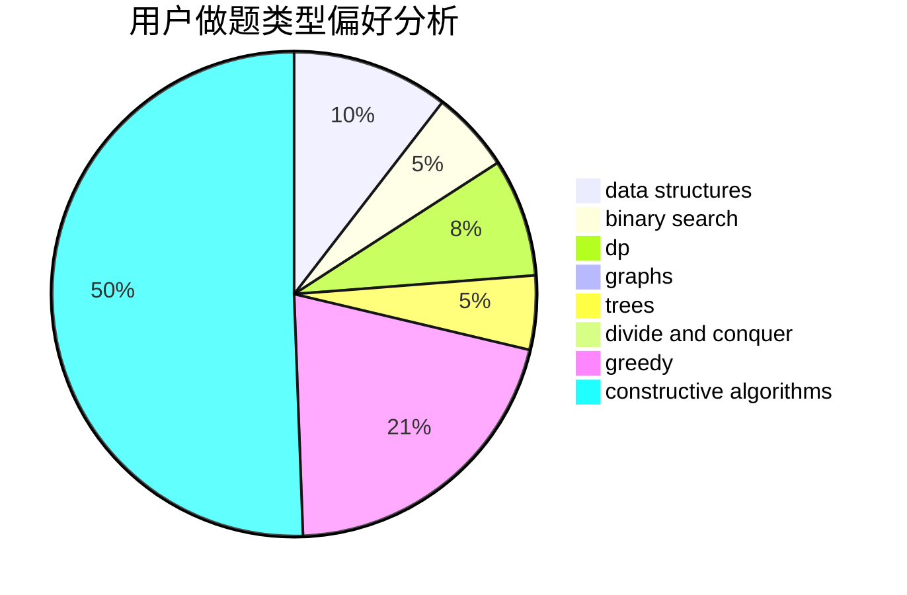
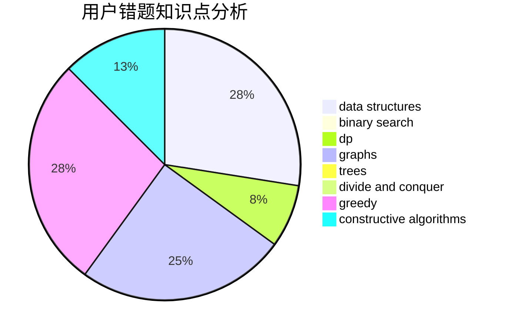

# jasonfan

<!-- tabs:start -->

#### **用户提交结果分析**

#### **用户做题类型偏好分析**

#### **用户错题知识点分析**

<!-- tabs:end -->
# 推荐题目
[1253A](https://codeforces.com/contest/1253/problem/A)		implementation		  
[1416A](https://codeforces.com/contest/1416/problem/A)		binary search,
                        data structures,
                        implementation,
                        two pointers		  
[1117C](https://codeforces.com/contest/1117/problem/C)		binary search		  
[318A](https://codeforces.com/contest/318/problem/A)		math		  
[360A](https://codeforces.com/contest/360/problem/A)		greedy,
                        implementation		  
[393C](https://codeforces.com/contest/393/problem/C)		dsu,graphs,sortings,trees		  
[847F](https://codeforces.com/contest/847/problem/F)		greedy,
                        sortings		  
[1034D](https://codeforces.com/contest/1034/problem/D)		binary search,
                        data structures,
                        two pointers		  
[266E](https://codeforces.com/contest/266/problem/E)		data structures,
                        math		  
[852E](https://codeforces.com/contest/852/problem/E)		dp		  
