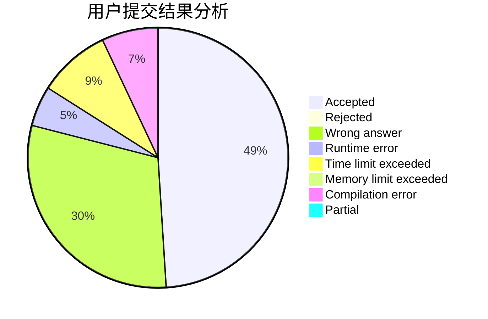
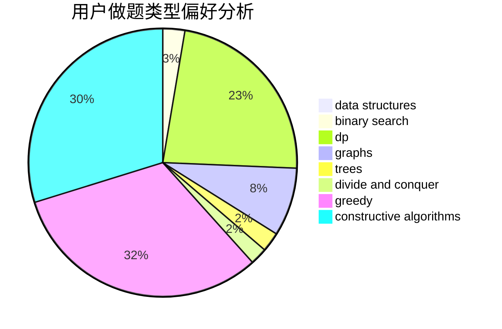
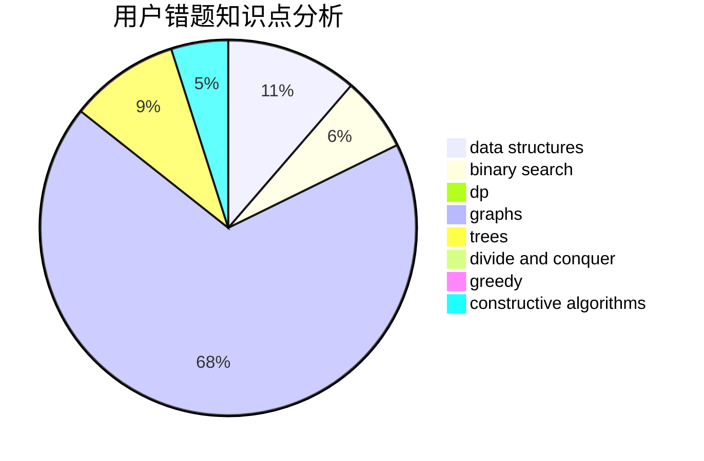

# jcvb

<!-- tabs:start -->

#### **用户提交结果分析**

#### **用户做题类型偏好分析**

#### **用户错题知识点分析**

<!-- tabs:end -->
# 推荐题目
[659F](https://codeforces.com/contest/659/problem/F)		dfs and similar,
                        dsu,
                        graphs,
                        greedy,
                        sortings		  
[1070E](https://codeforces.com/contest/1070/problem/E)		binary search,
                        data structures		  
[1091E](https://codeforces.com/contest/1091/problem/E)		binary search,
                        data structures,
                        graphs,
                        greedy,
                        implementation,
                        math,
                        sortings		  
[1383C](https://codeforces.com/contest/1383/problem/C)		bitmasks,
                        dp,
                        graphs,
                        trees		  
[965A](https://codeforces.com/contest/965/problem/A)		math		  
[903A](https://codeforces.com/contest/903/problem/A)		greedy,
                        implementation		  
[430B](https://codeforces.com/contest/430/problem/B)		brute force,
                        two pointers		  
[1009B](https://codeforces.com/contest/1009/problem/B)		greedy,
                        implementation		  
[720C](https://codeforces.com/contest/720/problem/C)		constructive algorithms		  
[152D](https://codeforces.com/contest/152/problem/D)		brute force		  
