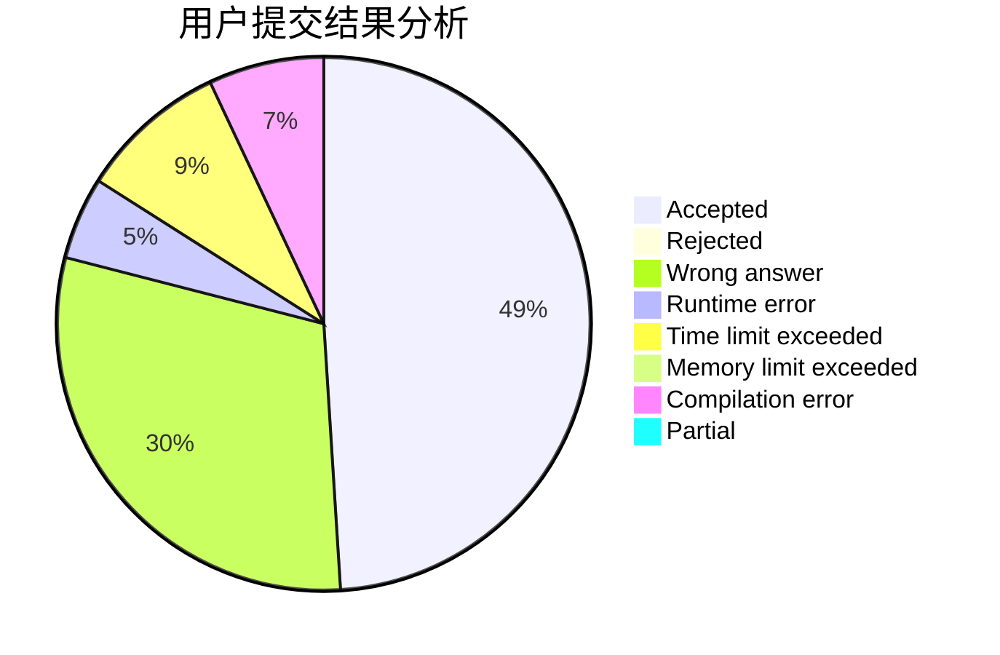
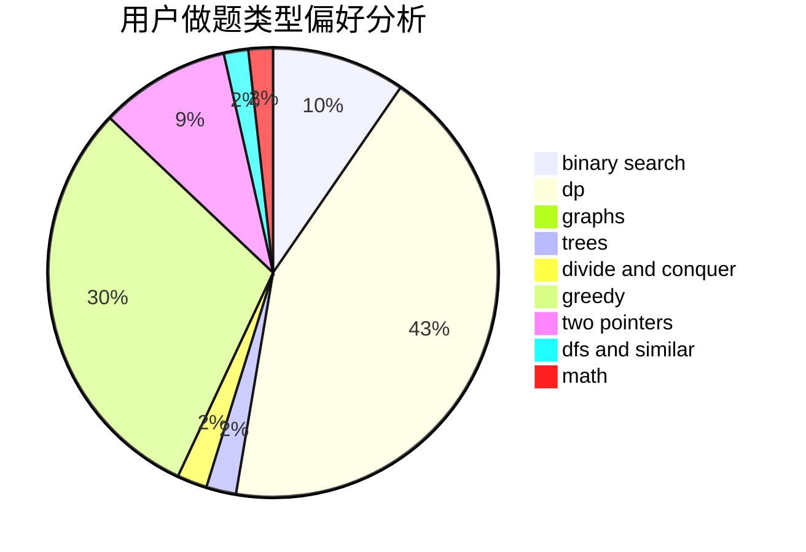

# jcvb

<!-- tabs:start -->

#### **用户提交结果分析**

#### **用户做题类型偏好分析**

<!-- tabs:end -->
# 推荐题目
[67A](https://codeforces.com/contest/67/problem/A)
[1070H](https://codeforces.com/contest/1070/problem/H)
[1091H](https://codeforces.com/contest/1091/problem/H)
[13932](https://codeforces.com/contest/1393/problem/2)
[987A](https://codeforces.com/contest/987/problem/A)
[919B](https://codeforces.com/contest/919/problem/B)
[452C](https://codeforces.com/contest/452/problem/C)
[1009E](https://codeforces.com/contest/1009/problem/E)
[737C](https://codeforces.com/contest/737/problem/C)
[175A](https://codeforces.com/contest/175/problem/A)
