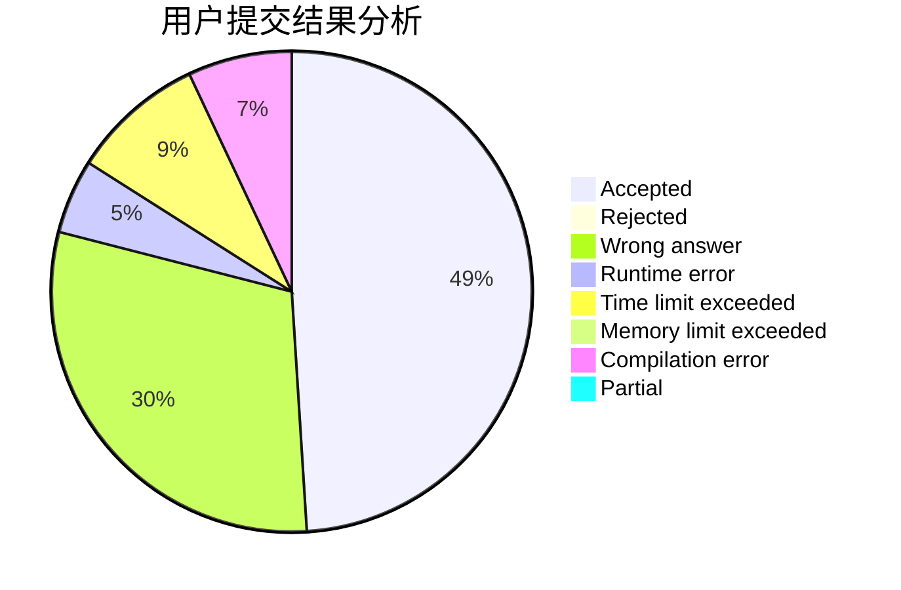
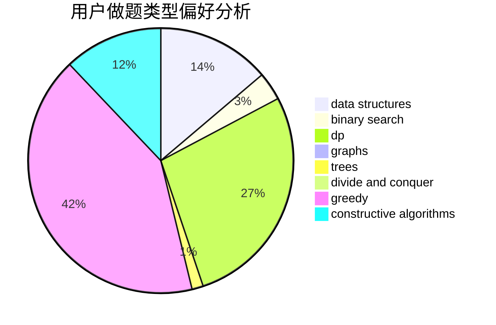
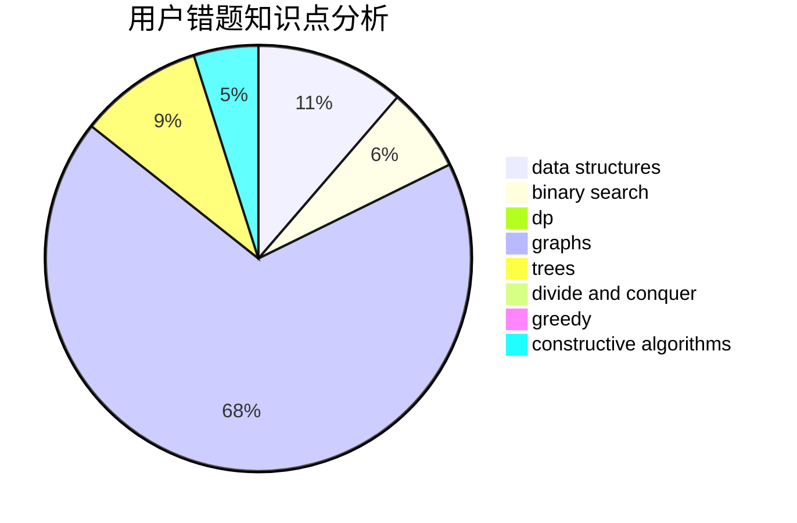

# jcvb

<!-- tabs:start -->

#### **用户提交结果分析**

#### **用户做题类型偏好分析**

#### **用户错题知识点分析**

<!-- tabs:end -->
# 推荐题目
[67A](https://codeforces.com/contest/67/problem/A)		dp,
                        graphs,
                        greedy,
                        implementation		  
[1070H](https://codeforces.com/contest/1070/problem/H)		brute force,
                        implementation		  
[1091H](https://codeforces.com/contest/1091/problem/H)		games		  
[13932](https://codeforces.com/contest/1393/problem/2)		dsu,graphs,sortings,trees		  
[987A](https://codeforces.com/contest/987/problem/A)		implementation		  
[919B](https://codeforces.com/contest/919/problem/B)		binary search,
                        brute force,
                        dp,
                        implementation,
                        number theory		  
[452C](https://codeforces.com/contest/452/problem/C)		combinatorics,
                        math,
                        probabilities		  
[1009E](https://codeforces.com/contest/1009/problem/E)		combinatorics,
                        math,
                        probabilities		  
[737C](https://codeforces.com/contest/737/problem/C)		dsu,graphs,sortings,trees		  
[175A](https://codeforces.com/contest/175/problem/A)		brute force,
                        implementation		  
