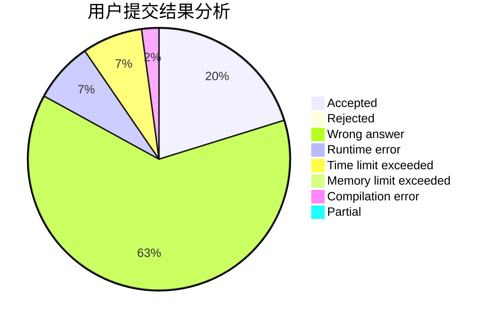
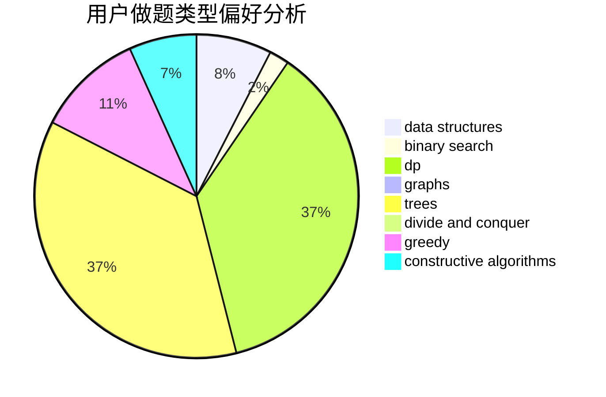
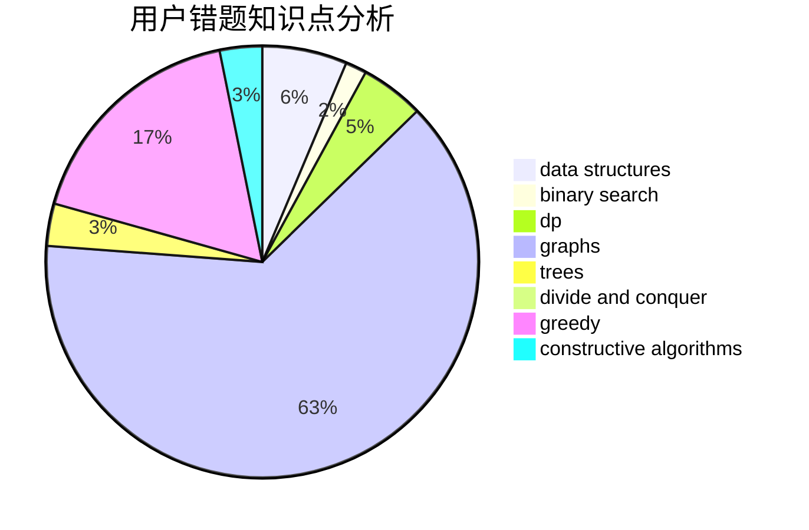

# jeff_qi

<!-- tabs:start -->

#### **用户提交结果分析**

#### **用户做题类型偏好分析**

#### **用户错题知识点分析**

<!-- tabs:end -->
# 推荐题目
[613E](https://codeforces.com/contest/613/problem/E)		dp,
                        hashing,
                        strings		  
[991A](https://codeforces.com/contest/991/problem/A)		implementation		  
[436A](https://codeforces.com/contest/436/problem/A)		greedy		  
[553B](https://codeforces.com/contest/553/problem/B)		binary search,
                        combinatorics,
                        constructive algorithms,
                        greedy,
                        implementation,
                        math		  
[1244E](https://codeforces.com/contest/1244/problem/E)		binary search,
                        constructive algorithms,
                        greedy,
                        sortings,
                        ternary search,
                        two pointers		  
[1489E](https://codeforces.com/contest/1489/problem/E)		dsu,graphs,sortings,trees		  
[741E](https://codeforces.com/contest/741/problem/E)		data structures,
                        string suffix structures		  
[984D](https://codeforces.com/contest/984/problem/D)		dsu,graphs,sortings,trees		  
[248E](https://codeforces.com/contest/248/problem/E)		dp,
                        math,
                        probabilities		  
[13701](https://codeforces.com/contest/1370/problem/1)		dsu,graphs,sortings,trees		  
