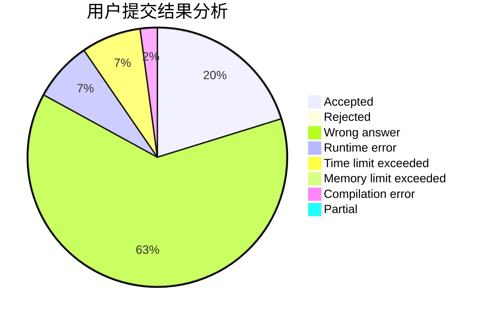
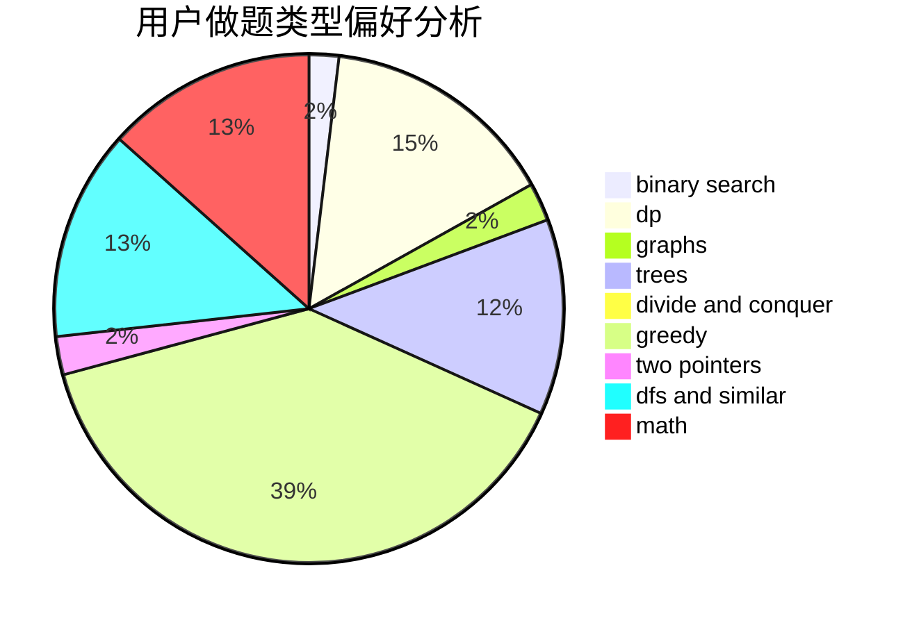

# jeff_qi

<!-- tabs:start -->

#### **用户提交结果分析**

#### **用户做题类型偏好分析**

<!-- tabs:end -->
# 推荐题目
[613E](https://codeforces.com/contest/613/problem/E)
[991A](https://codeforces.com/contest/991/problem/A)
[436A](https://codeforces.com/contest/436/problem/A)
[553B](https://codeforces.com/contest/553/problem/B)
[1244E](https://codeforces.com/contest/1244/problem/E)
[1489E](https://codeforces.com/contest/1489/problem/E)
[741E](https://codeforces.com/contest/741/problem/E)
[984D](https://codeforces.com/contest/984/problem/D)
[248E](https://codeforces.com/contest/248/problem/E)
[13701](https://codeforces.com/contest/1370/problem/1)
