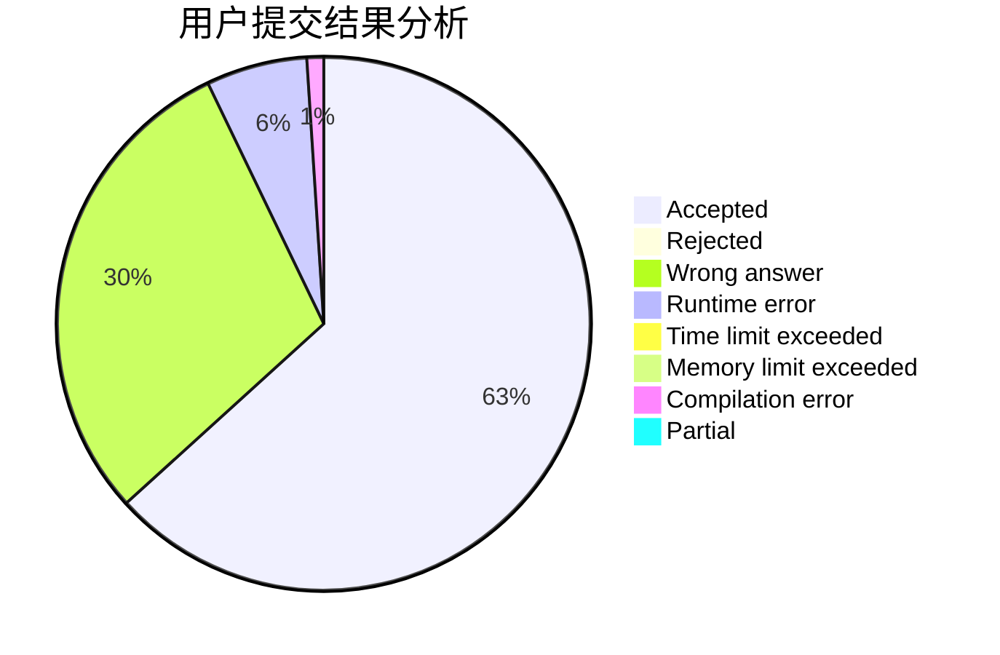
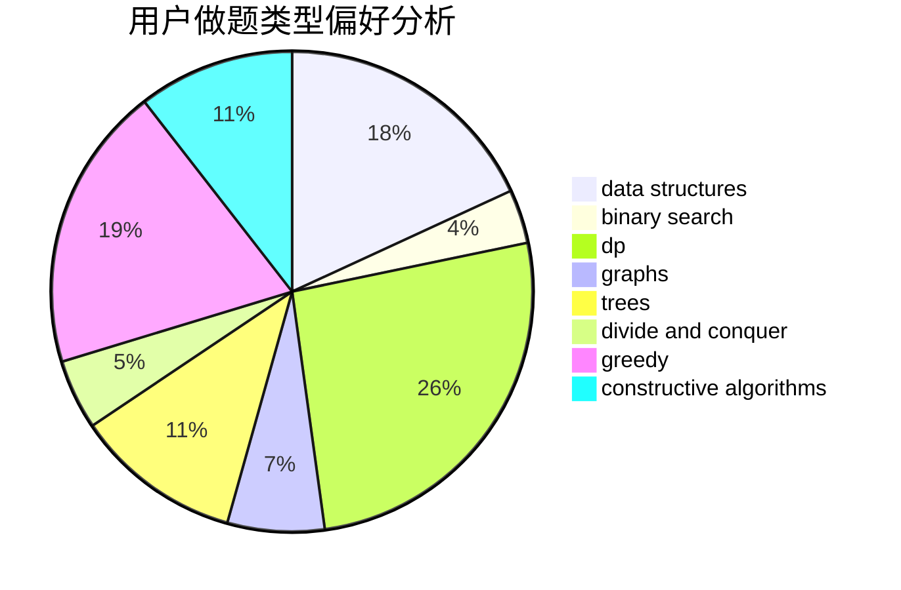
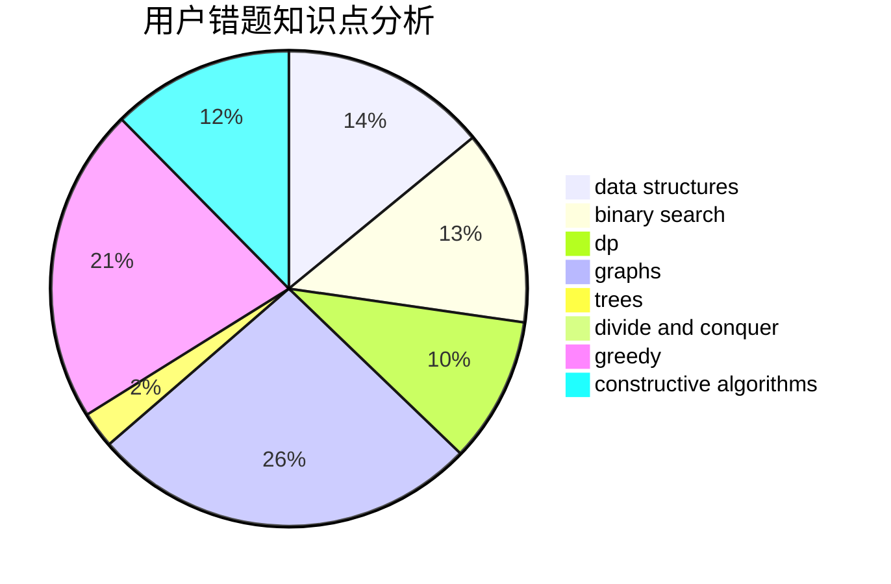

# jeffswt

<!-- tabs:start -->

#### **用户提交结果分析**

#### **用户做题类型偏好分析**

#### **用户错题知识点分析**

<!-- tabs:end -->
# 推荐题目
[963C](https://codeforces.com/contest/963/problem/C)		brute force,
                        math,
                        number theory		  
[139A](https://codeforces.com/contest/139/problem/A)		implementation		  
[803B](https://codeforces.com/contest/803/problem/B)		constructive algorithms		  
[935F](https://codeforces.com/contest/935/problem/F)		data structures,
                        greedy		  
[1346A](https://codeforces.com/contest/1346/problem/A)		*special problem,
                        math		  
[376A](https://codeforces.com/contest/376/problem/A)		implementation,
                        math		  
[689B](https://codeforces.com/contest/689/problem/B)		dfs and similar,
                        graphs,
                        greedy,
                        shortest paths		  
[1297A](https://codeforces.com/contest/1297/problem/A)		*special problem,
                        implementation		  
[1162D](https://codeforces.com/contest/1162/problem/D)		dsu,graphs,sortings,trees		  
[471D](https://codeforces.com/contest/471/problem/D)		string suffix structures,
                        strings		  
