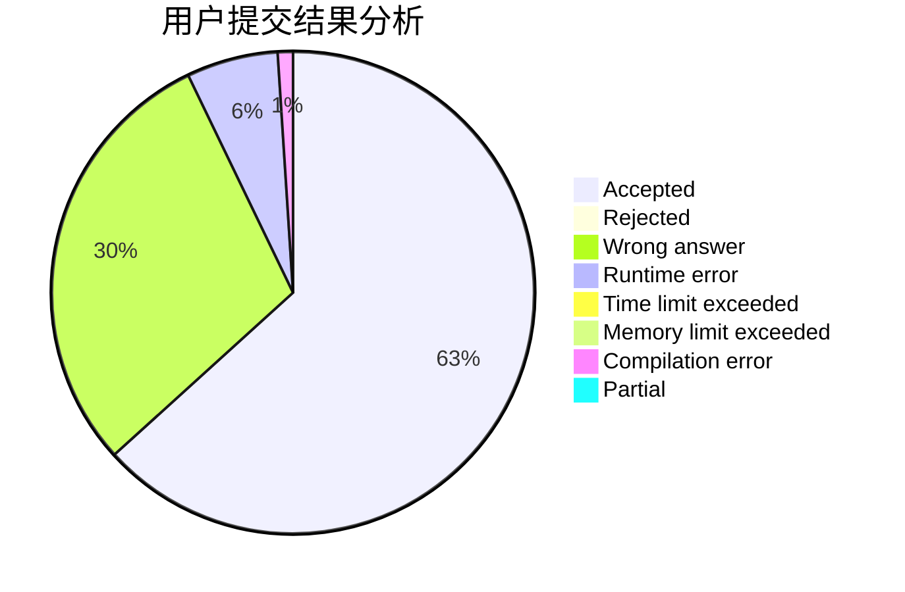
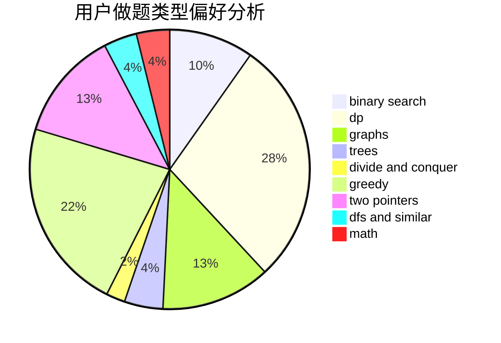

# jeffswt

<!-- tabs:start -->

#### **用户提交结果分析**

#### **用户做题类型偏好分析**

<!-- tabs:end -->
# 推荐题目
[963C](https://codeforces.com/contest/963/problem/C)
[139A](https://codeforces.com/contest/139/problem/A)
[803B](https://codeforces.com/contest/803/problem/B)
[935F](https://codeforces.com/contest/935/problem/F)
[1346A](https://codeforces.com/contest/1346/problem/A)
[376A](https://codeforces.com/contest/376/problem/A)
[689B](https://codeforces.com/contest/689/problem/B)
[1297A](https://codeforces.com/contest/1297/problem/A)
[1162D](https://codeforces.com/contest/1162/problem/D)
[471D](https://codeforces.com/contest/471/problem/D)
