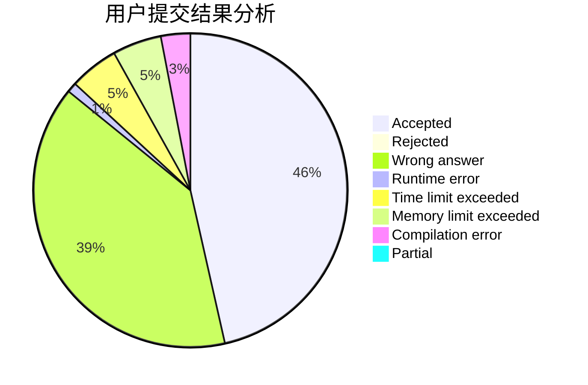
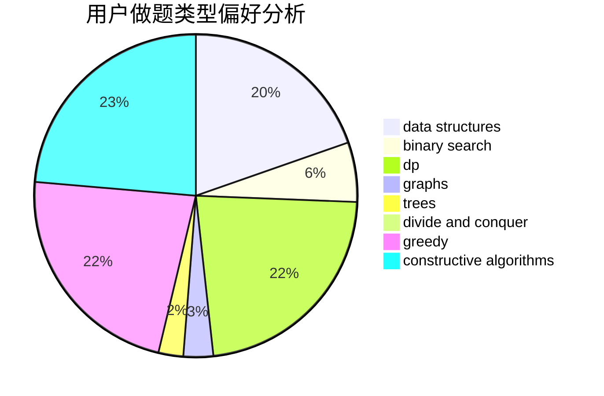
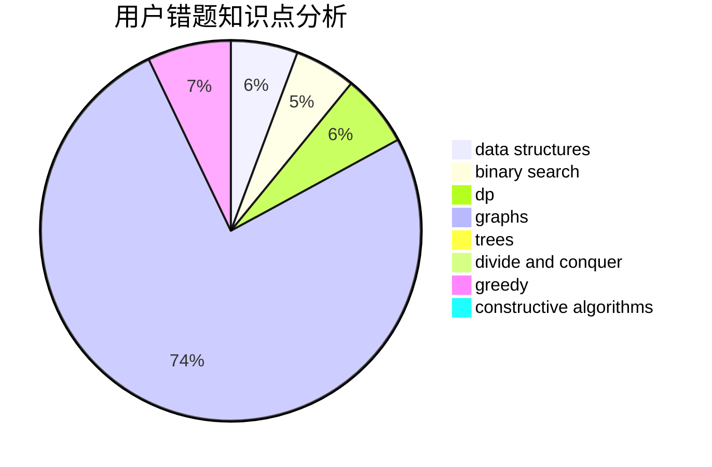

# BeautyYu

<!-- tabs:start -->

#### **用户提交结果分析**

#### **用户做题类型偏好分析**

#### **用户错题知识点分析**

<!-- tabs:end -->
# 推荐题目
[1228D](https://codeforces.com/contest/1228/problem/D)		brute force,
                        constructive algorithms,
                        graphs,
                        hashing,
                        implementation		  
[1080E](https://codeforces.com/contest/1080/problem/E)		strings		  
[1772](https://codeforces.com/contest/177/problem/2)		dsu,graphs,sortings,trees		  
[528C](https://codeforces.com/contest/528/problem/C)		dsu,graphs,sortings,trees		  
[529B](https://codeforces.com/contest/529/problem/B)		brute force,
                        greedy,
                        sortings		  
[1248C](https://codeforces.com/contest/1248/problem/C)		dsu,graphs,sortings,trees		  
[52C](https://codeforces.com/contest/52/problem/C)		data structures		  
[52B](https://codeforces.com/contest/52/problem/B)		combinatorics		  
[533A](https://codeforces.com/contest/533/problem/A)		binary search,
                        data structures,
                        dfs and similar,
                        greedy,
                        trees		  
[1091E](https://codeforces.com/contest/1091/problem/E)		binary search,
                        data structures,
                        graphs,
                        greedy,
                        implementation,
                        math,
                        sortings		  
