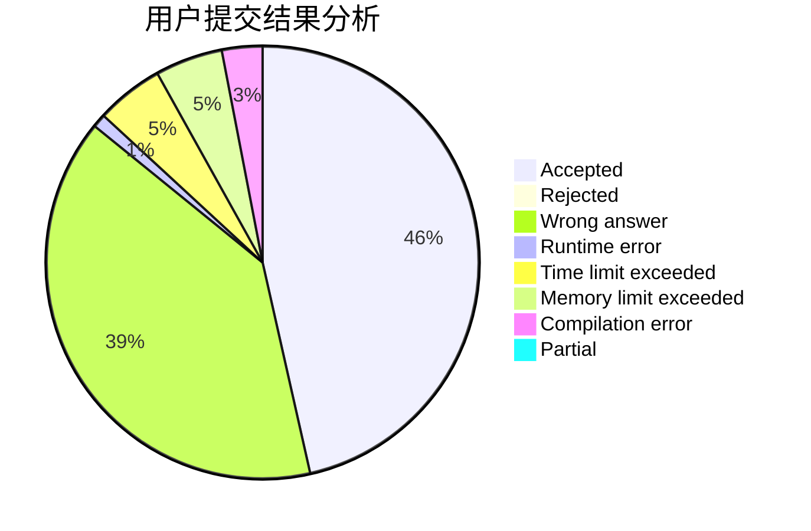
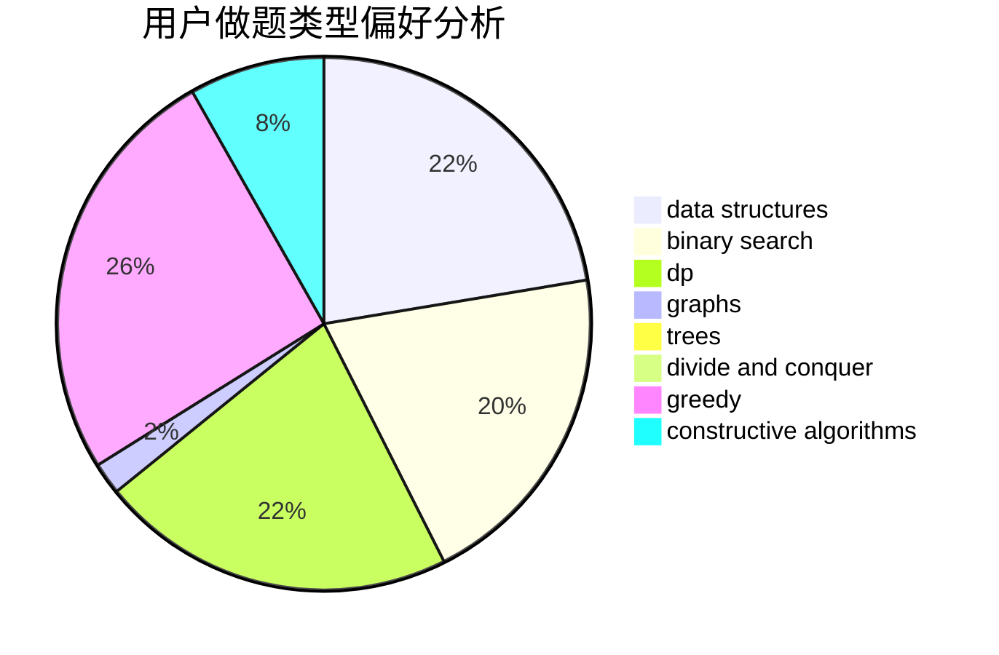
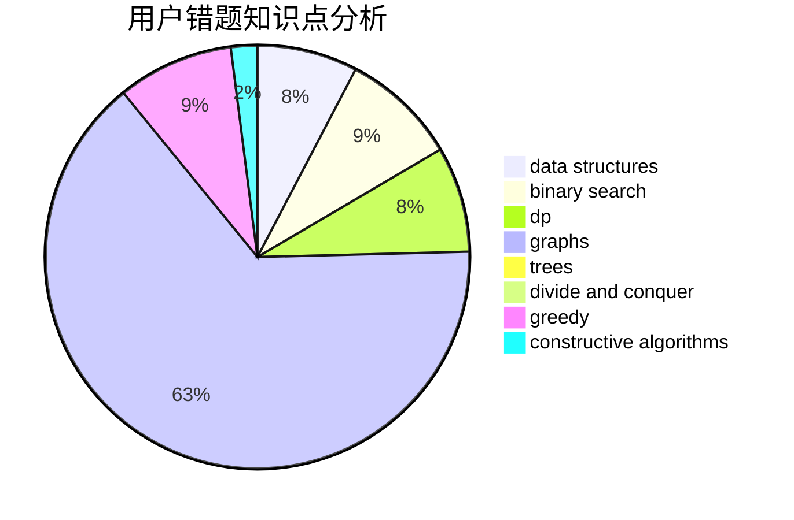

# BeautyYu

<!-- tabs:start -->

#### **用户提交结果分析**

#### **用户做题类型偏好分析**

#### **用户错题知识点分析**

<!-- tabs:end -->
# 推荐题目
[1220D](https://codeforces.com/contest/1220/problem/D)		bitmasks,
                        math,
                        number theory		  
[1080B](https://codeforces.com/contest/1080/problem/B)		math		  
[156D](https://codeforces.com/contest/156/problem/D)		combinatorics,
                        graphs		  
[508C](https://codeforces.com/contest/508/problem/C)		constructive algorithms,
                        greedy		  
[508E](https://codeforces.com/contest/508/problem/E)		dp,
                        greedy		  
[1243C](https://codeforces.com/contest/1243/problem/C)		dsu,graphs,sortings,trees		  
[509D](https://codeforces.com/contest/509/problem/D)		constructive algorithms,
                        math		  
[509C](https://codeforces.com/contest/509/problem/C)		dp,
                        greedy,
                        implementation		  
[50A](https://codeforces.com/contest/50/problem/A)		greedy,
                        math		  
[1091B](https://codeforces.com/contest/1091/problem/B)		brute force,
                        constructive algorithms,
                        greedy,
                        implementation		  
