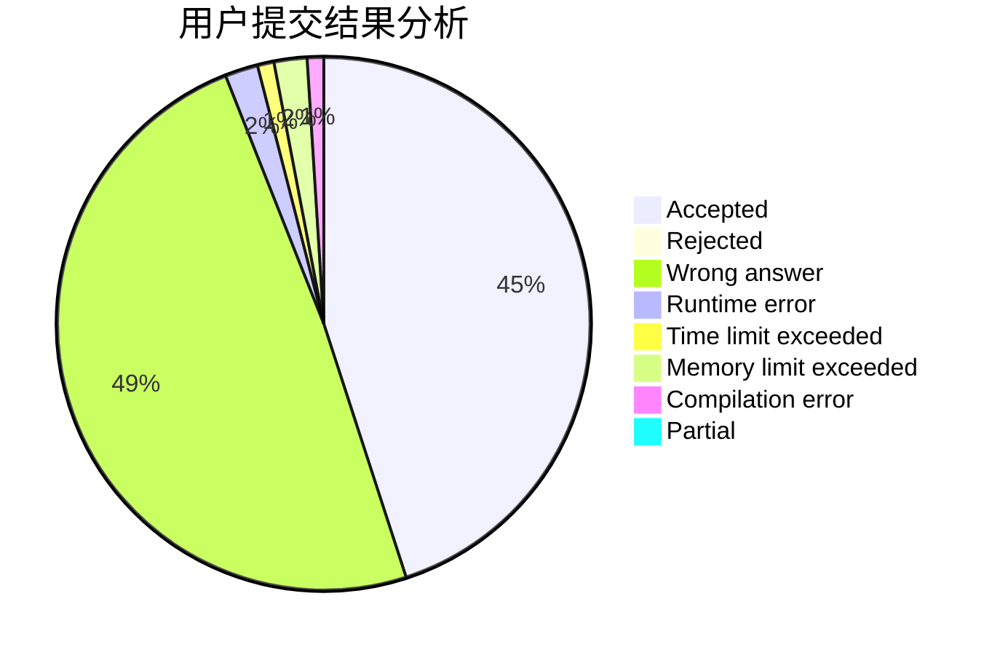
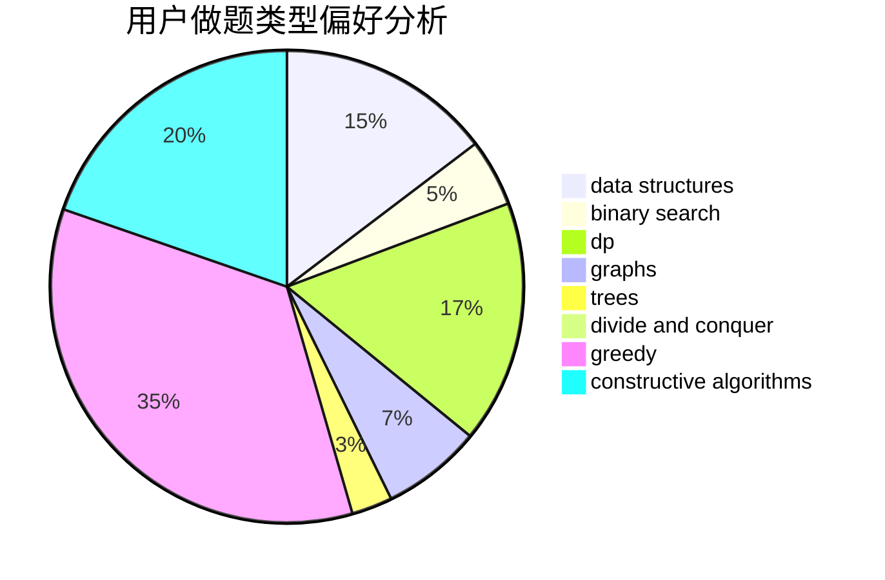
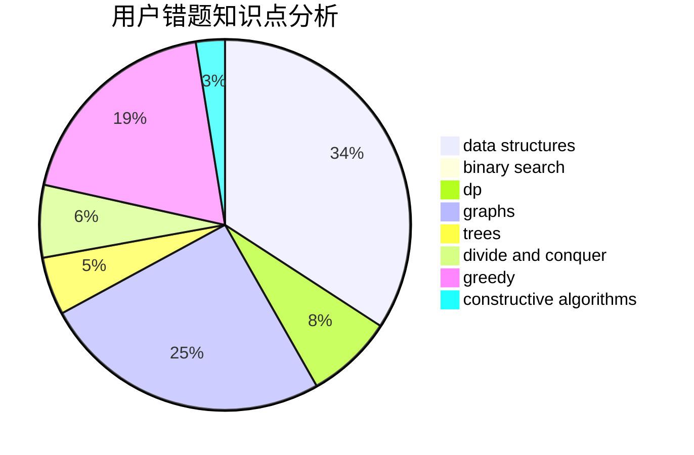

# jerry.jiang

<!-- tabs:start -->

#### **用户提交结果分析**

#### **用户做题类型偏好分析**

#### **用户错题知识点分析**

<!-- tabs:end -->
# 推荐题目
[1478F](https://codeforces.com/contest/1478/problem/F)		dsu,graphs,sortings,trees		  
[875C](https://codeforces.com/contest/875/problem/C)		2-sat,
                        dfs and similar,
                        graphs,
                        implementation		  
[1487F](https://codeforces.com/contest/1487/problem/F)		dp,
                        greedy,
                        shortest paths		  
[1234A](https://codeforces.com/contest/1234/problem/A)		math		  
[1245C](https://codeforces.com/contest/1245/problem/C)		dp		  
[1033C](https://codeforces.com/contest/1033/problem/C)		brute force,
                        dp,
                        games		  
[1201D](https://codeforces.com/contest/1201/problem/D)		binary search,
                        dp,
                        greedy,
                        implementation		  
[447A](https://codeforces.com/contest/447/problem/A)		implementation		  
[791A](https://codeforces.com/contest/791/problem/A)		implementation		  
[91A](https://codeforces.com/contest/91/problem/A)		greedy,
                        strings		  
