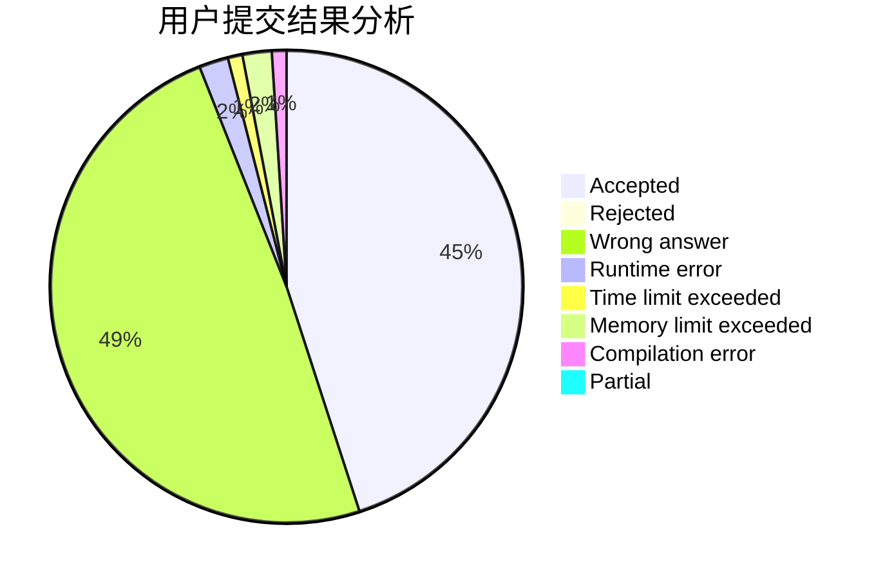
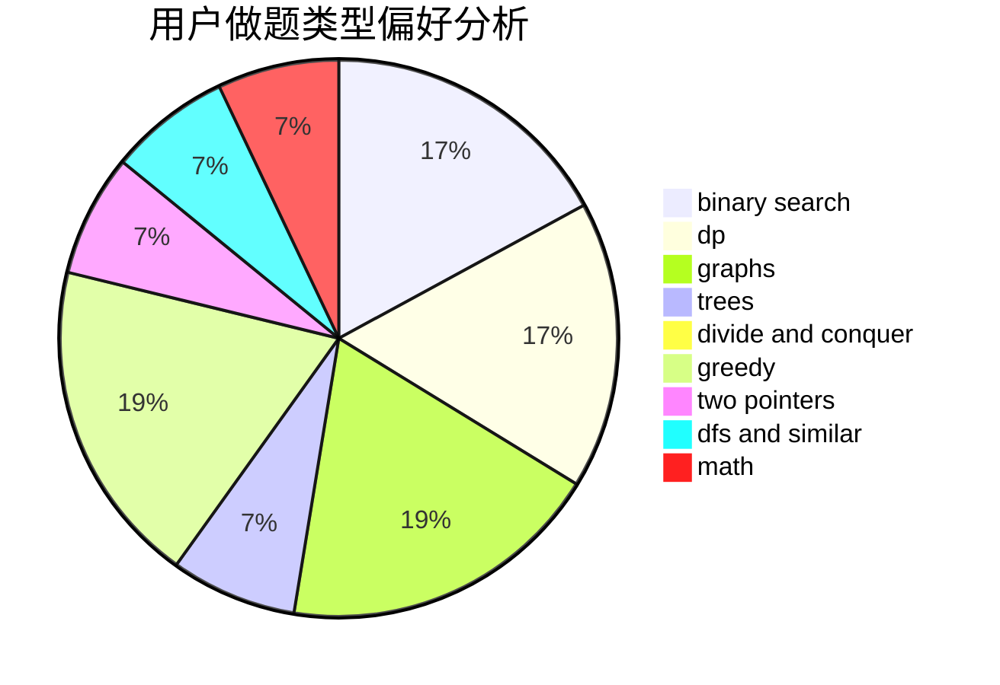

# jerry.jiang

<!-- tabs:start -->

#### **用户提交结果分析**

#### **用户做题类型偏好分析**

<!-- tabs:end -->
# 推荐题目
[1487D](https://codeforces.com/contest/1487/problem/D)
[895C](https://codeforces.com/contest/895/problem/C)
[1495C](https://codeforces.com/contest/1495/problem/C)
[1239E](https://codeforces.com/contest/1239/problem/E)
[1250E](https://codeforces.com/contest/1250/problem/E)
[1033F](https://codeforces.com/contest/1033/problem/F)
[1206B](https://codeforces.com/contest/1206/problem/B)
[467C](https://codeforces.com/contest/467/problem/C)
[805C](https://codeforces.com/contest/805/problem/C)
[93C](https://codeforces.com/contest/93/problem/C)
