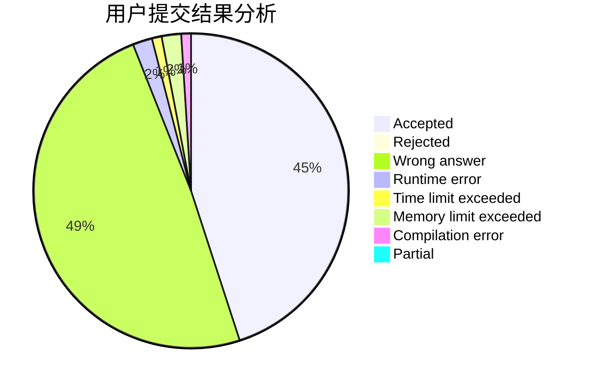
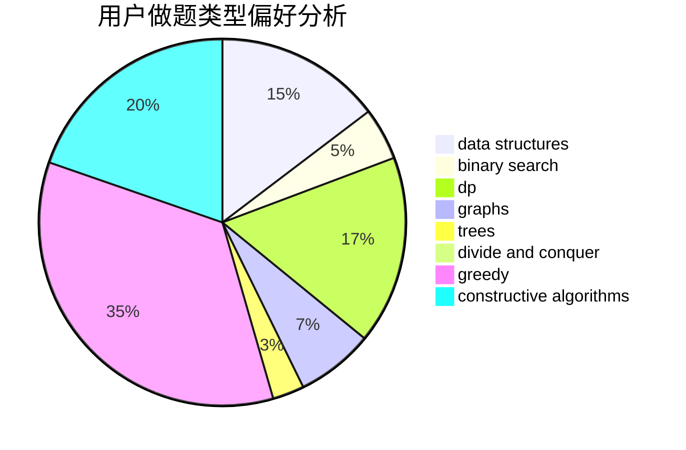
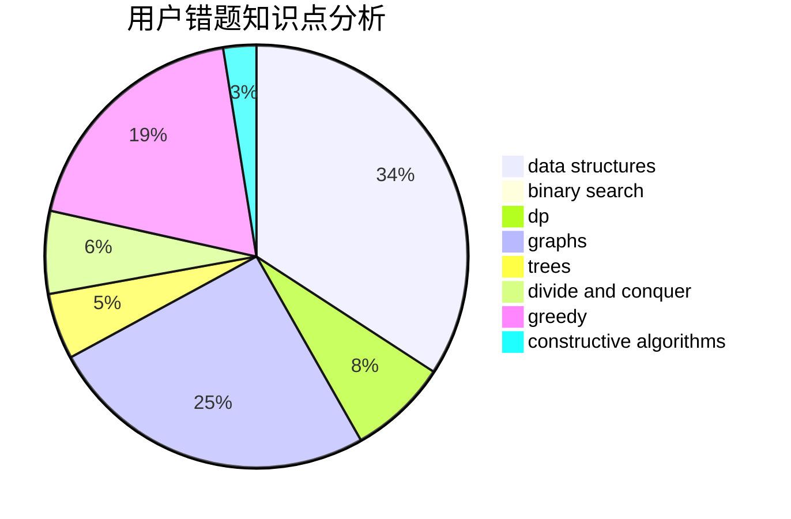

# jerry.jiang
<!-- tabs:start -->
#### **用户提交结果分析**

#### **用户做题类型偏好分析**

#### **用户错题知识点分析**

<!-- tabs:end -->
# 推荐题目
[Equalize Prices Again](http://codeforces.com/problemset/problem/1234/A)		math		  
[Peculiar apple-tree](https://codeforces.com/contest/931/problem/D)		dfs and similar,
                        graphs,
                        trees		  
[Distinct Characters Queries](http://codeforces.com/problemset/problem/1234/D)		data structures		  
[Array Sharpening](http://codeforces.com/problemset/problem/1291/B)		greedy,
                        implementation		  
[Billiard](http://codeforces.com/problemset/problem/982/E)		geometry,
                        number theory		  
[Max Correct Set](http://codeforces.com/problemset/problem/1463/F)		bitmasks,
                        dp,
                        math		  
[Bash Plays with Functions](http://codeforces.com/problemset/problem/757/E)		brute force,
                        combinatorics,
                        dp,
                        number theory		  
[Vacations](https://codeforces.com/contest/699/problem/C)		dp		  
[K Integers](http://codeforces.com/problemset/problem/1268/C)		binary search,
                        data structures		  
[Ilya and Matrix](http://codeforces.com/problemset/problem/313/C)		constructive algorithms,
                        greedy,
                        implementation,
                        sortings		  
<!-- tabs:start -->
#### **data structures**
[Equalize Prices Again](http://codeforces.com/problemset/problem/1234/D)		data structures		  
[Peculiar apple-tree](http://codeforces.com/problemset/problem/1268/C)		binary search,
                        data structures		  
[Distinct Characters Queries](http://codeforces.com/problemset/problem/652/D)		data structures,
                        sortings		  
[Array Sharpening](https://codeforces.com/contest/1321/problem/F)		data structures,
                        hashing,
                        strings		  
[Billiard](http://codeforces.com/problemset/problem/552/D)		brute force,
                        combinatorics,
                        data structures,
                        geometry,
                        math,
                        sortings		  
[Max Correct Set](http://codeforces.com/problemset/problem/158/C)		*special problem,
                        data structures,
                        implementation		  
[Bash Plays with Functions](http://codeforces.com/problemset/problem/983/D)		data structures		  
[Vacations](http://codeforces.com/problemset/problem/1196/D2)		data structures,
                        dp,
                        implementation,
                        two pointers		  
[K Integers](http://codeforces.com/problemset/problem/29/C)		data structures,
                        dfs and similar,
                        graphs,
                        implementation		  
[Ilya and Matrix](http://codeforces.com/problemset/problem/1106/B)		data structures,
                        implementation		  
#### **binary search**
[Equalize Prices Again](http://codeforces.com/problemset/problem/1268/C)		binary search,
                        data structures		  
[Peculiar apple-tree](http://codeforces.com/problemset/problem/1427/H)		binary search,
                        games,
                        geometry,
                        ternary search		  
[Distinct Characters Queries](http://codeforces.com/problemset/problem/1201/D)		binary search,
                        dp,
                        greedy,
                        implementation		  
[Array Sharpening](http://codeforces.com/problemset/problem/808/E)		binary search,
                        dp,
                        greedy,
                        ternary search		  
[Billiard](http://codeforces.com/problemset/problem/1492/C)		binary search,
                        data structures,
                        dp,
                        greedy,
                        two pointers		  
[Max Correct Set](http://codeforces.com/problemset/problem/1463/D)		binary search,
                        constructive algorithms,
                        greedy,
                        two pointers		  
[Bash Plays with Functions](http://codeforces.com/problemset/problem/1490/G)		binary search,
                        data structures,
                        math		  
[Vacations](http://codeforces.com/problemset/problem/1479/D)		binary search,
                        bitmasks,
                        brute force,
                        data structures,
                        probabilities,
                        trees		  
[K Integers](http://codeforces.com/problemset/problem/1436/E)		binary search,
                        data structures,
                        two pointers		  
[Ilya and Matrix](http://codeforces.com/problemset/problem/1461/D)		binary search,
                        brute force,
                        data structures,
                        divide and conquer,
                        implementation,
                        sortings		  
#### **dp**
[Equalize Prices Again](http://codeforces.com/problemset/problem/1463/F)		bitmasks,
                        dp,
                        math		  
[Peculiar apple-tree](http://codeforces.com/problemset/problem/757/E)		brute force,
                        combinatorics,
                        dp,
                        number theory		  
[Distinct Characters Queries](https://codeforces.com/contest/699/problem/C)		dp		  
[Array Sharpening](https://codeforces.com/contest/800/problem/C)		constructive algorithms,
                        dp,
                        graphs,
                        math,
                        number theory		  
[Billiard](http://codeforces.com/problemset/problem/1033/C)		brute force,
                        dp,
                        games		  
[Max Correct Set](http://codeforces.com/problemset/problem/1487/F)		dp,
                        greedy,
                        shortest paths		  
[Bash Plays with Functions](http://codeforces.com/problemset/problem/1196/D2)		data structures,
                        dp,
                        implementation,
                        two pointers		  
[Vacations](http://codeforces.com/problemset/problem/401/D)		bitmasks,
                        brute force,
                        combinatorics,
                        dp,
                        number theory		  
[K Integers](http://codeforces.com/problemset/problem/1201/D)		binary search,
                        dp,
                        greedy,
                        implementation		  
[Ilya and Matrix](http://codeforces.com/problemset/problem/1109/A)		dp,
                        implementation		  
#### **graph**
[Equalize Prices Again](https://codeforces.com/contest/931/problem/D)		dfs and similar,
                        graphs,
                        trees		  
[Peculiar apple-tree](http://codeforces.com/problemset/problem/875/C)		2-sat,
                        dfs and similar,
                        graphs,
                        implementation		  
[Distinct Characters Queries](https://codeforces.com/contest/800/problem/C)		constructive algorithms,
                        dp,
                        graphs,
                        math,
                        number theory		  
[Array Sharpening](http://codeforces.com/problemset/problem/46/F)		dsu,
                        graphs		  
[Billiard](http://codeforces.com/problemset/problem/761/E)		constructive algorithms,
                        dfs and similar,
                        graphs,
                        greedy,
                        trees		  
[Max Correct Set](http://codeforces.com/problemset/problem/29/C)		data structures,
                        dfs and similar,
                        graphs,
                        implementation		  
[Bash Plays with Functions](http://codeforces.com/problemset/problem/662/B)		dfs and similar,
                        graphs		  
[Vacations](http://codeforces.com/problemset/problem/698/B)		constructive algorithms,
                        dfs and similar,
                        dsu,
                        graphs,
                        trees		  
[K Integers](http://codeforces.com/problemset/problem/1320/B)		dfs and similar,
                        graphs,
                        shortest paths		  
[Ilya and Matrix](http://codeforces.com/problemset/problem/773/D)		dp,
                        graphs,
                        shortest paths		  
#### **trees**
[Equalize Prices Again](https://codeforces.com/contest/931/problem/D)		dfs and similar,
                        graphs,
                        trees		  
[Peculiar apple-tree](http://codeforces.com/problemset/problem/761/E)		constructive algorithms,
                        dfs and similar,
                        graphs,
                        greedy,
                        trees		  
[Distinct Characters Queries](http://codeforces.com/problemset/problem/698/B)		constructive algorithms,
                        dfs and similar,
                        dsu,
                        graphs,
                        trees		  
[Array Sharpening](http://codeforces.com/problemset/problem/821/C)		data structures,
                        greedy,
                        trees		  
[Billiard](http://codeforces.com/problemset/problem/1172/B)		combinatorics,
                        dfs and similar,
                        dp,
                        trees		  
[Max Correct Set](http://codeforces.com/problemset/problem/526/G)		greedy,
                        trees		  
[Bash Plays with Functions](http://codeforces.com/problemset/problem/1479/D)		binary search,
                        bitmasks,
                        brute force,
                        data structures,
                        probabilities,
                        trees		  
[Vacations](http://codeforces.com/problemset/problem/1511/C)		brute force,
                        data structures,
                        implementation,
                        trees		  
[K Integers](http://codeforces.com/problemset/problem/1499/F)		combinatorics,
                        dfs and similar,
                        dp,
                        trees		  
[Ilya and Matrix](http://codeforces.com/problemset/problem/1491/E)		brute force,
                        dfs and similar,
                        divide and conquer,
                        number theory,
                        trees		  
#### **divide and conquer**
[Equalize Prices Again](http://codeforces.com/problemset/problem/459/D)		data structures,
                        divide and conquer,
                        sortings		  
[Peculiar apple-tree](http://codeforces.com/problemset/problem/1461/D)		binary search,
                        brute force,
                        data structures,
                        divide and conquer,
                        implementation,
                        sortings		  
[Distinct Characters Queries](http://codeforces.com/problemset/problem/1466/G)		combinatorics,
                        divide and conquer,
                        hashing,
                        math,
                        string suffix structures,
                        strings		  
[Array Sharpening](http://codeforces.com/problemset/problem/1490/D)		dfs and similar,
                        divide and conquer,
                        implementation		  
[Billiard](https://codeforces.com/contest/1483/problem/C)		data structures,
                        divide and conquer,
                        dp		  
[Max Correct Set](http://codeforces.com/problemset/problem/1491/E)		brute force,
                        dfs and similar,
                        divide and conquer,
                        number theory,
                        trees		  
[Bash Plays with Functions](http://codeforces.com/problemset/problem/1303/G)		data structures,
                        divide and conquer,
                        geometry,
                        trees		  
[Vacations](http://codeforces.com/problemset/problem/1494/D)		constructive algorithms,
                        data structures,
                        dfs and similar,
                        divide and conquer,
                        dsu,
                        greedy,
                        sortings,
                        trees		  
[K Integers](http://codeforces.com/problemset/problem/1482/E)		data structures,
                        divide and conquer,
                        dp		  
[Ilya and Matrix](http://codeforces.com/problemset/problem/566/C)		dfs and similar,
                        divide and conquer,
                        trees		  
#### **greedy**
[Equalize Prices Again](http://codeforces.com/problemset/problem/1291/B)		greedy,
                        implementation		  
[Peculiar apple-tree](http://codeforces.com/problemset/problem/313/C)		constructive algorithms,
                        greedy,
                        implementation,
                        sortings		  
[Distinct Characters Queries](http://codeforces.com/problemset/problem/91/A)		greedy,
                        strings		  
[Array Sharpening](http://codeforces.com/problemset/problem/1487/F)		dp,
                        greedy,
                        shortest paths		  
[Billiard](http://codeforces.com/problemset/problem/1000/B)		greedy		  
[Max Correct Set](http://codeforces.com/problemset/problem/761/E)		constructive algorithms,
                        dfs and similar,
                        graphs,
                        greedy,
                        trees		  
[Bash Plays with Functions](http://codeforces.com/problemset/problem/1082/B)		greedy		  
[Vacations](http://codeforces.com/problemset/problem/1431/D)		*special problem,
                        greedy		  
[K Integers](http://codeforces.com/problemset/problem/436/A)		greedy		  
[Ilya and Matrix](https://codeforces.com/contest/1072/problem/C)		greedy		  
#### **constructive algorithms**
[Equalize Prices Again](http://codeforces.com/problemset/problem/313/C)		constructive algorithms,
                        greedy,
                        implementation,
                        sortings		  
[Peculiar apple-tree](https://codeforces.com/contest/800/problem/C)		constructive algorithms,
                        dp,
                        graphs,
                        math,
                        number theory		  
[Distinct Characters Queries](http://codeforces.com/problemset/problem/761/E)		constructive algorithms,
                        dfs and similar,
                        graphs,
                        greedy,
                        trees		  
[Array Sharpening](https://codeforces.com/contest/1478/problem/F)		constructive algorithms,
                        geometry,
                        greedy,
                        math,
                        sortings		  
[Billiard](http://codeforces.com/problemset/problem/698/B)		constructive algorithms,
                        dfs and similar,
                        dsu,
                        graphs,
                        trees		  
[Max Correct Set](http://codeforces.com/problemset/problem/515/D)		constructive algorithms,
                        greedy		  
[Bash Plays with Functions](http://codeforces.com/problemset/problem/1348/C)		constructive algorithms,
                        greedy,
                        sortings,
                        strings		  
[Vacations](http://codeforces.com/problemset/problem/1452/F)		constructive algorithms,
                        greedy		  
[K Integers](http://codeforces.com/problemset/problem/1088/A)		brute force,
                        constructive algorithms		  
[Ilya and Matrix](http://codeforces.com/problemset/problem/804/A)		constructive algorithms,
                        greedy,
                        math		  
#### **sortings**
[Equalize Prices Again](http://codeforces.com/problemset/problem/313/C)		constructive algorithms,
                        greedy,
                        implementation,
                        sortings		  
[Peculiar apple-tree](http://codeforces.com/problemset/problem/652/D)		data structures,
                        sortings		  
[Distinct Characters Queries](http://codeforces.com/problemset/problem/552/D)		brute force,
                        combinatorics,
                        data structures,
                        geometry,
                        math,
                        sortings		  
[Array Sharpening](https://codeforces.com/contest/1478/problem/F)		constructive algorithms,
                        geometry,
                        greedy,
                        math,
                        sortings		  
[Billiard](http://codeforces.com/problemset/problem/1348/C)		constructive algorithms,
                        greedy,
                        sortings,
                        strings		  
[Max Correct Set](http://codeforces.com/problemset/problem/459/D)		data structures,
                        divide and conquer,
                        sortings		  
[Bash Plays with Functions](https://codeforces.com/contest/1496/problem/C)		geometry,
                        greedy,
                        math,
                        sortings		  
[Vacations](http://codeforces.com/problemset/problem/1495/A)		geometry,
                        greedy,
                        math,
                        sortings		  
[K Integers](http://codeforces.com/problemset/problem/1497/A)		brute force,
                        data structures,
                        greedy,
                        sortings		  
[Ilya and Matrix](http://codeforces.com/problemset/problem/1427/A)		math,
                        sortings		  
<!-- tabs:end -->
