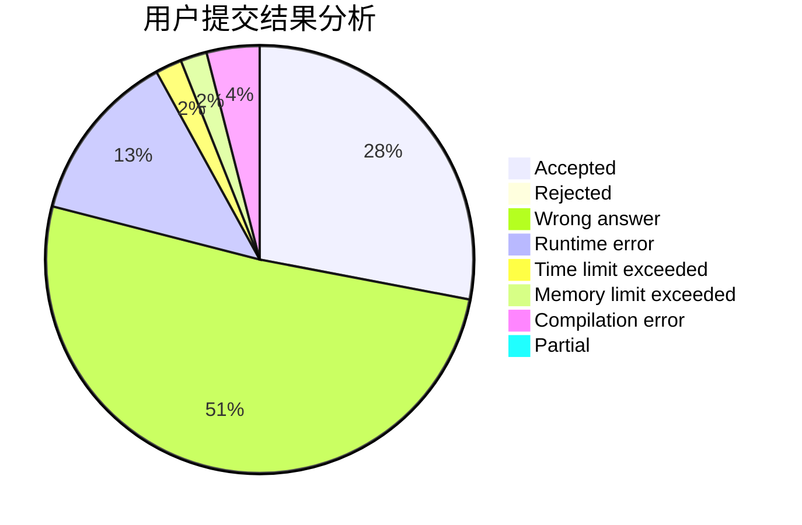
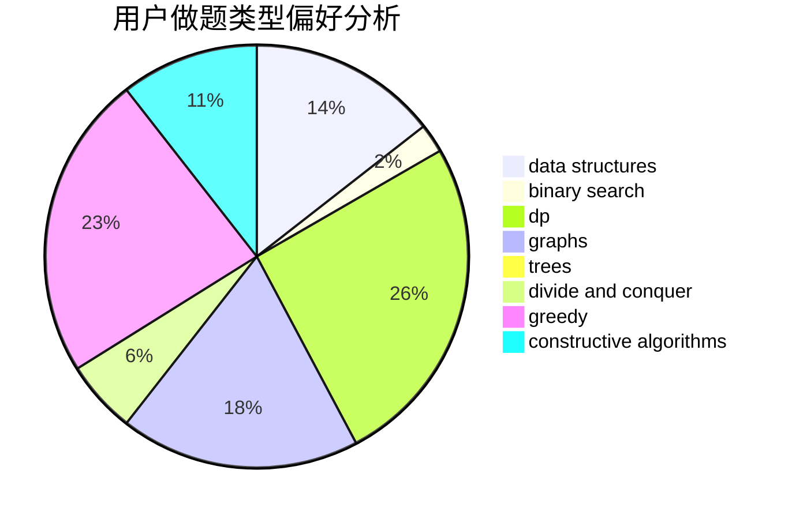
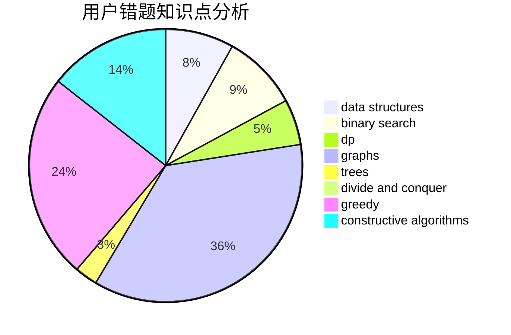

# jerry3128

<!-- tabs:start -->

#### **用户提交结果分析**

#### **用户做题类型偏好分析**

#### **用户错题知识点分析**

<!-- tabs:end -->
# 推荐题目
[1103E](https://codeforces.com/contest/1103/problem/E)		fft,
                        math,
                        number theory		  
[1284B](https://codeforces.com/contest/1284/problem/B)		binary search,
                        combinatorics,
                        data structures,
                        dp,
                        implementation,
                        sortings		  
[125A](https://codeforces.com/contest/125/problem/A)		math		  
[1241C](https://codeforces.com/contest/1241/problem/C)		dsu,graphs,sortings,trees		  
[575G](https://codeforces.com/contest/575/problem/G)		dfs and similar,
                        shortest paths		  
[865D](https://codeforces.com/contest/865/problem/D)		constructive algorithms,
                        data structures,
                        greedy		  
[418C](https://codeforces.com/contest/418/problem/C)		dsu,graphs,sortings,trees		  
[920A](https://codeforces.com/contest/920/problem/A)		implementation		  
[1055F](https://codeforces.com/contest/1055/problem/F)		strings,
                        trees		  
[571E](https://codeforces.com/contest/571/problem/E)		math		  
