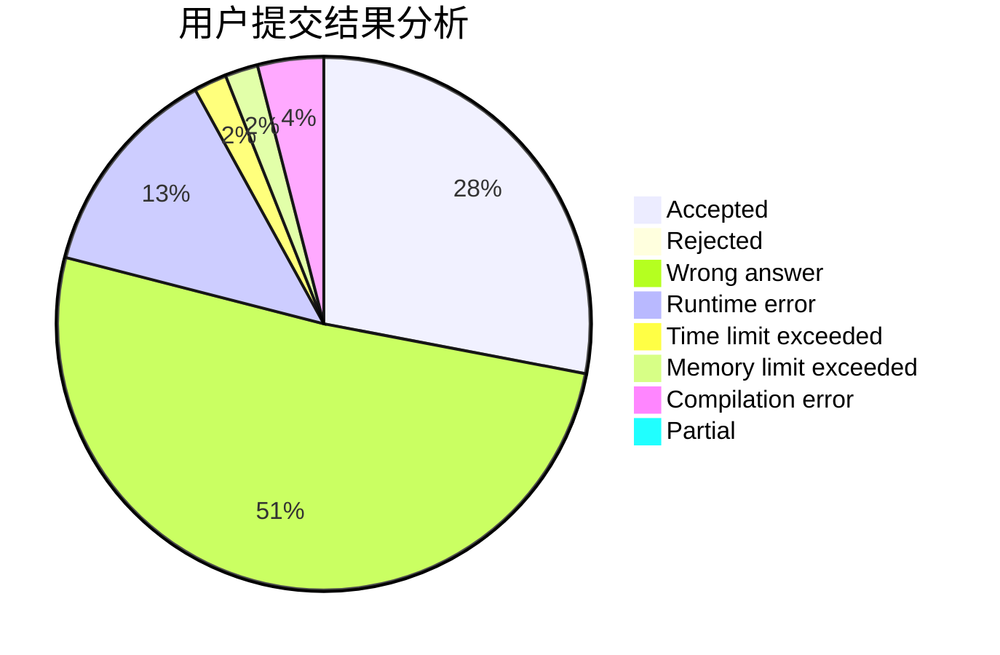
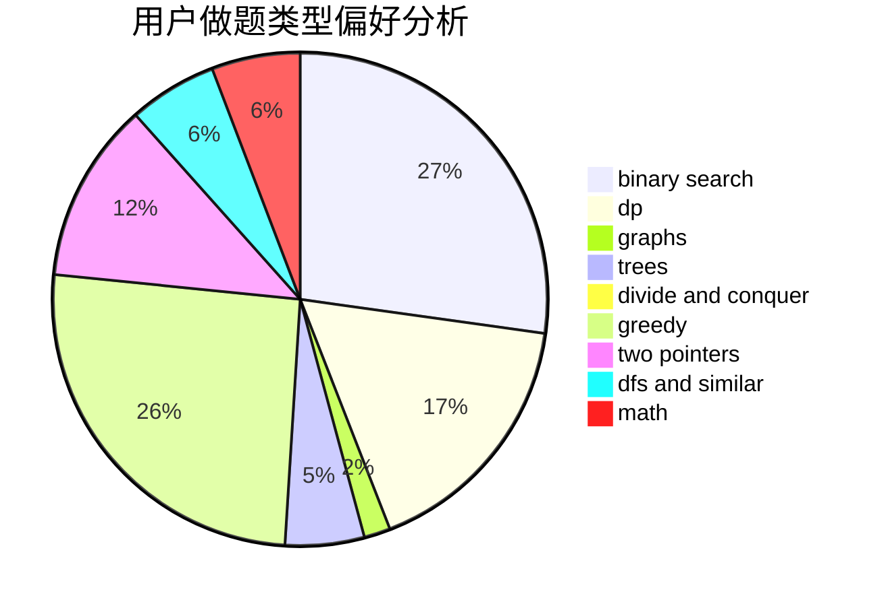

# jerry3128

<!-- tabs:start -->

#### **用户提交结果分析**

#### **用户做题类型偏好分析**

<!-- tabs:end -->
# 推荐题目
[1104C](https://codeforces.com/contest/1104/problem/C)
[1291B](https://codeforces.com/contest/1291/problem/B)
[1265C](https://codeforces.com/contest/1265/problem/C)
[12471](https://codeforces.com/contest/1247/problem/1)
[597B](https://codeforces.com/contest/597/problem/B)
[886A](https://codeforces.com/contest/886/problem/A)
[443D](https://codeforces.com/contest/443/problem/D)
[940A](https://codeforces.com/contest/940/problem/A)
[1056C](https://codeforces.com/contest/1056/problem/C)
[592B](https://codeforces.com/contest/592/problem/B)
