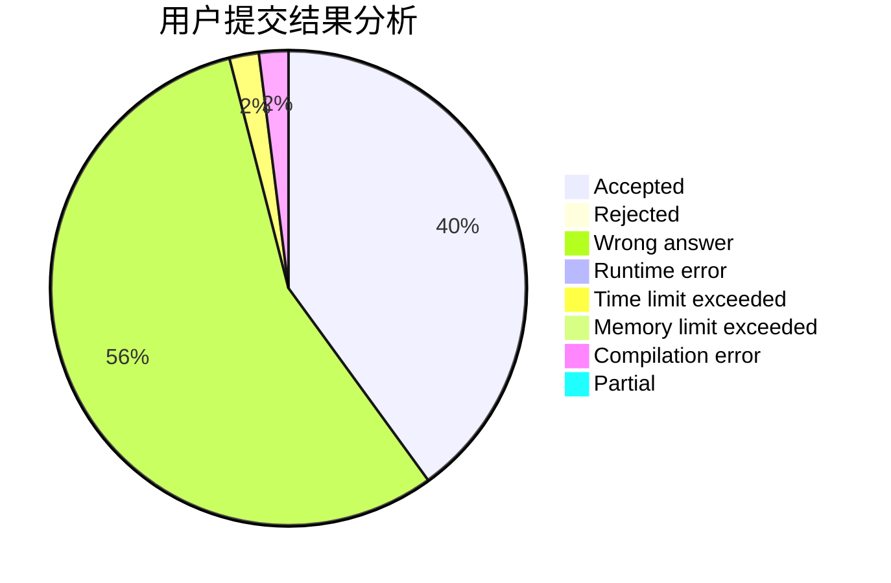
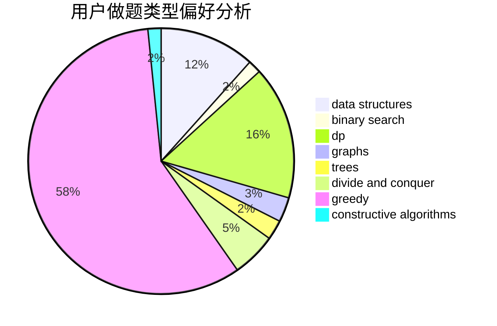

# jerryfish233

<!-- tabs:start -->

#### **用户提交结果分析**

#### **用户做题类型偏好分析**

#### **用户错题知识点分析**

<!-- tabs:end -->
# 推荐题目
[204D](https://codeforces.com/contest/204/problem/D)		dp		  
[1386B](https://codeforces.com/contest/1386/problem/B)		*special problem,
                        data structures,
                        geometry,
                        math,
                        sortings		  
[898A](https://codeforces.com/contest/898/problem/A)		implementation,
                        math		  
[1000A](https://codeforces.com/contest/1000/problem/A)		greedy,
                        implementation		  
[662A](https://codeforces.com/contest/662/problem/A)		bitmasks,
                        math,
                        matrices,
                        probabilities		  
[1028H](https://codeforces.com/contest/1028/problem/H)		math		  
[781C](https://codeforces.com/contest/781/problem/C)		dsu,graphs,sortings,trees		  
[1400E](https://codeforces.com/contest/1400/problem/E)		data structures,
                        divide and conquer,
                        dp,
                        greedy		  
[510B](https://codeforces.com/contest/510/problem/B)		dfs and similar		  
[946E](https://codeforces.com/contest/946/problem/E)		greedy,
                        implementation		  
