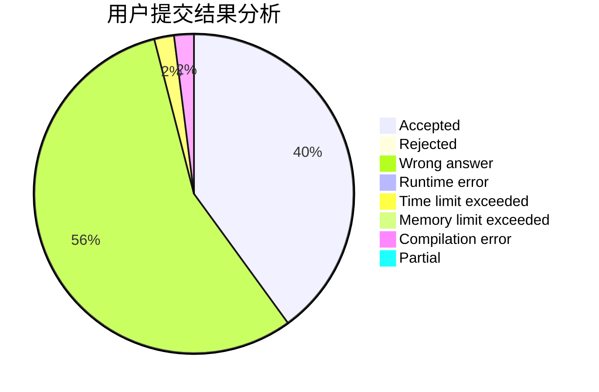
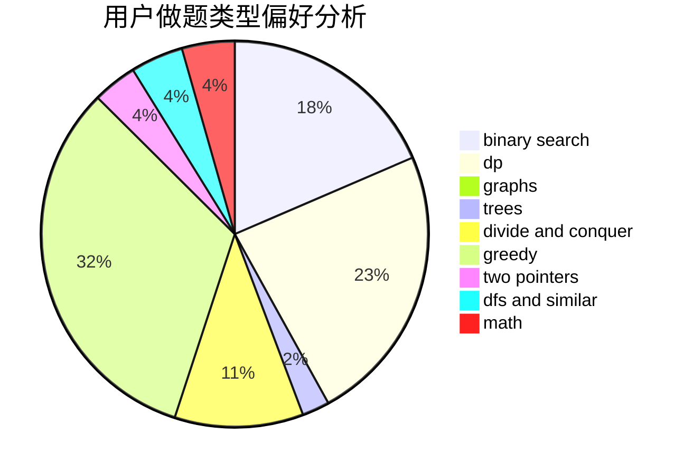

# jerryfish233

<!-- tabs:start -->

#### **用户提交结果分析**

#### **用户做题类型偏好分析**

<!-- tabs:end -->
# 推荐题目
[228D](https://codeforces.com/contest/228/problem/D)
[1396C](https://codeforces.com/contest/1396/problem/C)
[914C](https://codeforces.com/contest/914/problem/C)
[1000A](https://codeforces.com/contest/1000/problem/A)
[682A](https://codeforces.com/contest/682/problem/A)
[1029C](https://codeforces.com/contest/1029/problem/C)
[7A](https://codeforces.com/contest/7/problem/A)
[140E](https://codeforces.com/contest/140/problem/E)
[533E](https://codeforces.com/contest/533/problem/E)
[963B](https://codeforces.com/contest/963/problem/B)
