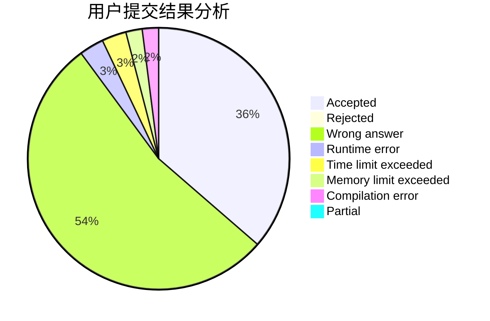
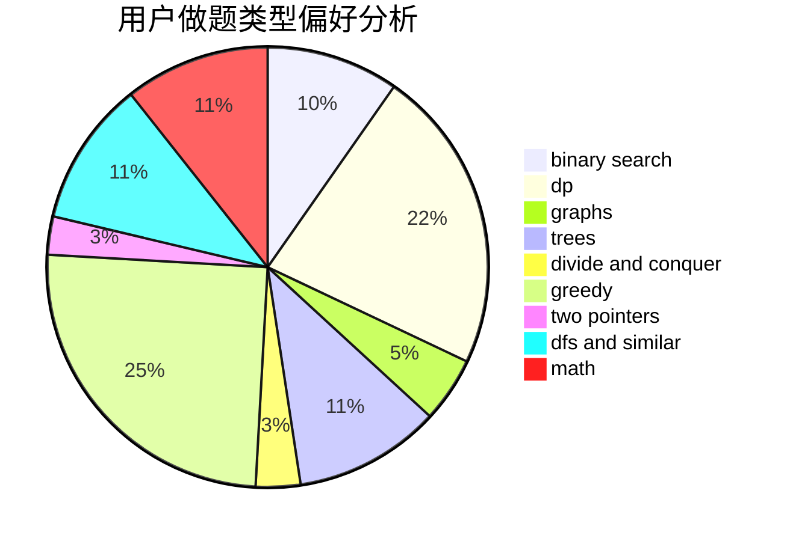

# jerrywcy

<!-- tabs:start -->

#### **用户提交结果分析**

#### **用户做题类型偏好分析**

<!-- tabs:end -->
# 推荐题目
[1487B](https://codeforces.com/contest/1487/problem/B)
[1345D](https://codeforces.com/contest/1345/problem/D)
[1488B](https://codeforces.com/contest/1488/problem/B)
[12621](https://codeforces.com/contest/1262/problem/1)
[868F](https://codeforces.com/contest/868/problem/F)
[1076C](https://codeforces.com/contest/1076/problem/C)
[1386B](https://codeforces.com/contest/1386/problem/B)
[1372F](https://codeforces.com/contest/1372/problem/F)
[465D](https://codeforces.com/contest/465/problem/D)
[688A](https://codeforces.com/contest/688/problem/A)
