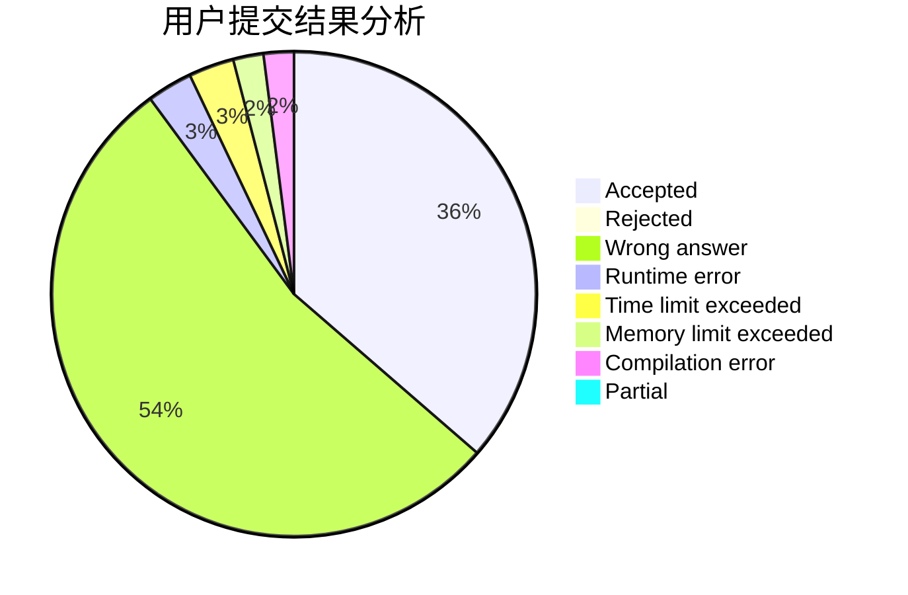
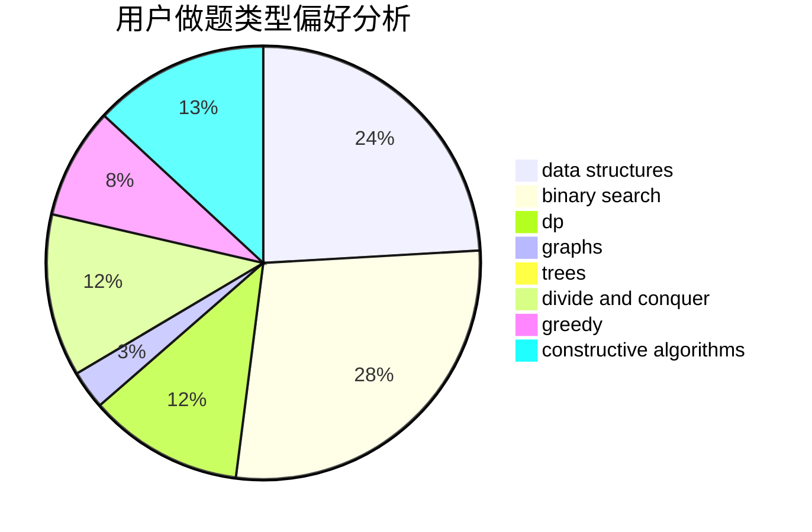

# jerrywcy

<!-- tabs:start -->

#### **用户提交结果分析**

#### **用户做题类型偏好分析**

#### **用户错题知识点分析**

<!-- tabs:end -->
# 推荐题目
[1478D](https://codeforces.com/contest/1478/problem/D)		dsu,graphs,sortings,trees		  
[1338C](https://codeforces.com/contest/1338/problem/C)		bitmasks,
                        brute force,
                        constructive algorithms,
                        divide and conquer,
                        math		  
[1479D](https://codeforces.com/contest/1479/problem/D)		binary search,
                        bitmasks,
                        brute force,
                        data structures,
                        probabilities,
                        trees		  
[1254D](https://codeforces.com/contest/1254/problem/D)		data structures,
                        probabilities,
                        trees		  
[84C](https://codeforces.com/contest/84/problem/C)		binary search,
                        implementation		  
[1075A](https://codeforces.com/contest/1075/problem/A)		implementation,
                        math		  
[1377A1](https://codeforces.com/contest/1377A/problem/1)		dsu,graphs,sortings,trees		  
[1366A](https://codeforces.com/contest/1366/problem/A)		binary search,
                        greedy,
                        math		  
[445B](https://codeforces.com/contest/445/problem/B)		dfs and similar,
                        dsu,
                        greedy		  
[666D](https://codeforces.com/contest/666/problem/D)		brute force,
                        geometry		  
