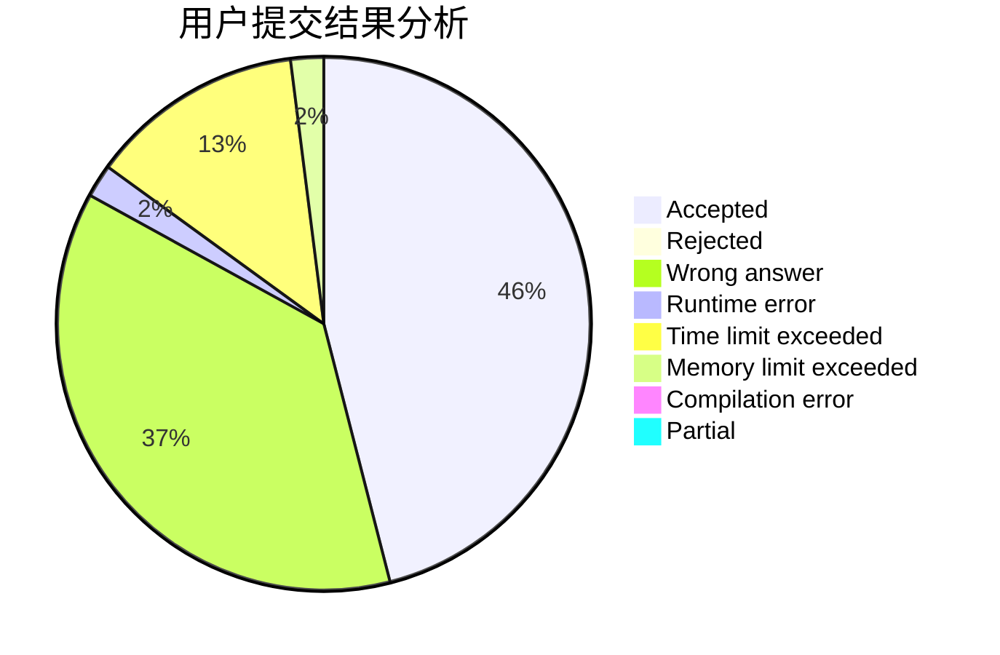
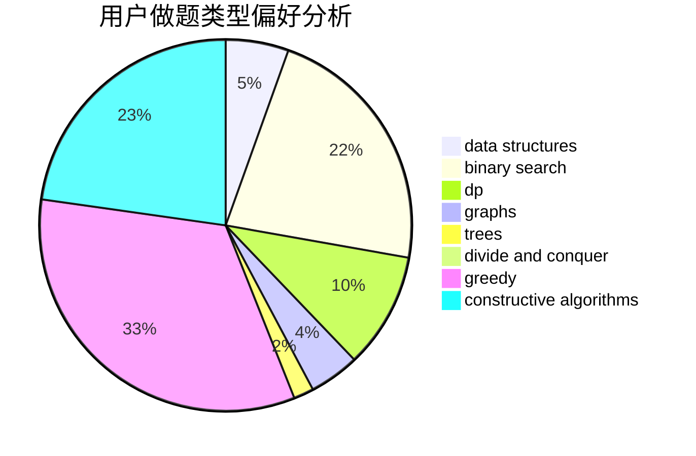
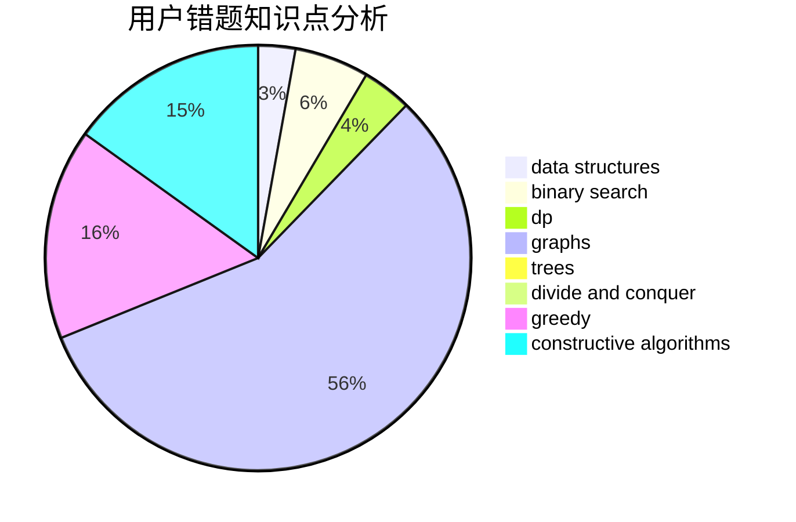

# jfy

<!-- tabs:start -->

#### **用户提交结果分析**

#### **用户做题类型偏好分析**

#### **用户错题知识点分析**

<!-- tabs:end -->
# 推荐题目
[875F](https://codeforces.com/contest/875/problem/F)		dsu,
                        graphs,
                        greedy		  
[62E](https://codeforces.com/contest/62/problem/E)		dp,
                        flows		  
[1066C](https://codeforces.com/contest/1066/problem/C)		implementation		  
[920A](https://codeforces.com/contest/920/problem/A)		implementation		  
[566A](https://codeforces.com/contest/566/problem/A)		dfs and similar,
                        strings,
                        trees		  
[235C](https://codeforces.com/contest/235/problem/C)		data structures,
                        string suffix structures,
                        strings		  
[1074B](https://codeforces.com/contest/1074/problem/B)		dsu,graphs,sortings,trees		  
[316E3](https://codeforces.com/contest/316E/problem/3)		data structures,
                        math		  
[1366A](https://codeforces.com/contest/1366/problem/A)		binary search,
                        greedy,
                        math		  
[1172B](https://codeforces.com/contest/1172/problem/B)		combinatorics,
                        dfs and similar,
                        dp,
                        trees		  
