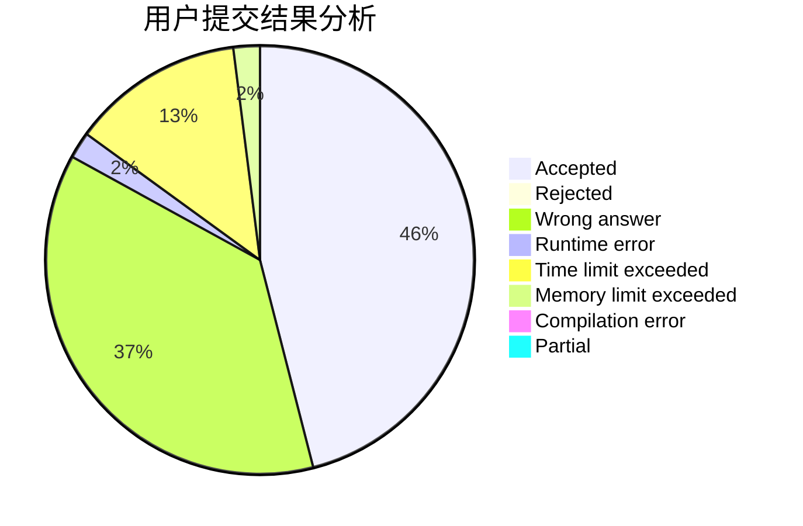
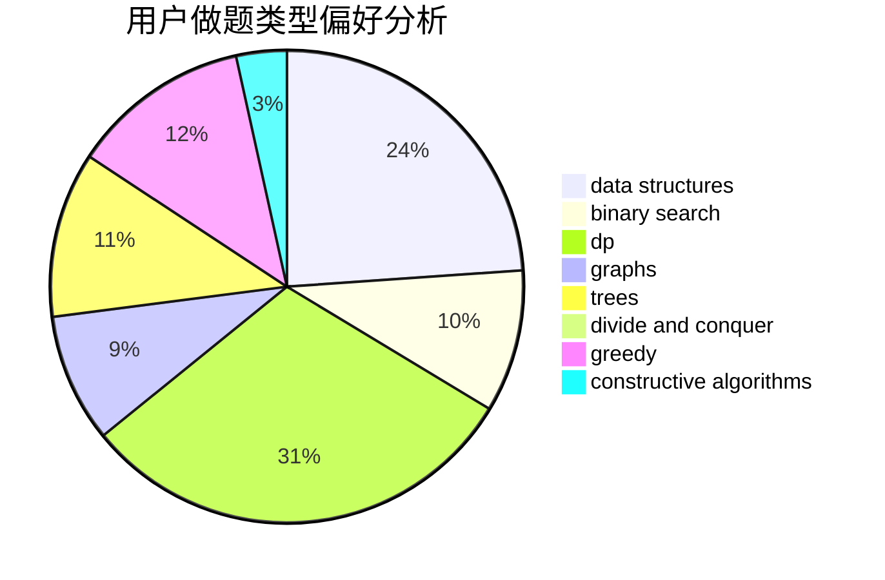
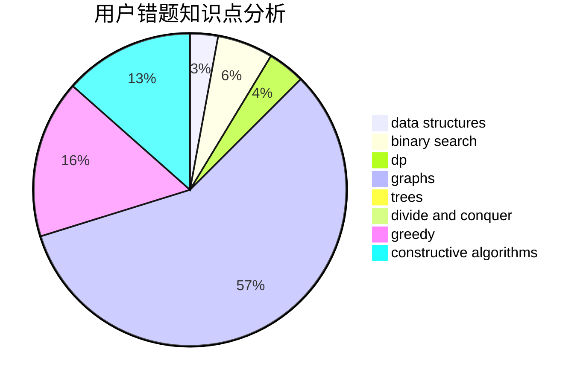

# jfy

<!-- tabs:start -->

#### **用户提交结果分析**

#### **用户做题类型偏好分析**

#### **用户错题知识点分析**

<!-- tabs:end -->
# 推荐题目
[896A](https://codeforces.com/contest/896/problem/A)		binary search,
                        dfs and similar		  
[659G](https://codeforces.com/contest/659/problem/G)		combinatorics,
                        dp,
                        number theory		  
[1066F](https://codeforces.com/contest/1066/problem/F)		dp		  
[940A](https://codeforces.com/contest/940/problem/A)		brute force,
                        greedy,
                        sortings		  
[584E](https://codeforces.com/contest/584/problem/E)		constructive algorithms,
                        greedy,
                        math		  
[258B](https://codeforces.com/contest/258/problem/B)		brute force,
                        combinatorics,
                        dp		  
[1076A](https://codeforces.com/contest/1076/problem/A)		greedy,
                        strings		  
[343B](https://codeforces.com/contest/343/problem/B)		data structures,
                        greedy,
                        implementation		  
[1372F](https://codeforces.com/contest/1372/problem/F)		binary search,
                        divide and conquer,
                        interactive		  
[1174D](https://codeforces.com/contest/1174/problem/D)		bitmasks,
                        constructive algorithms		  
