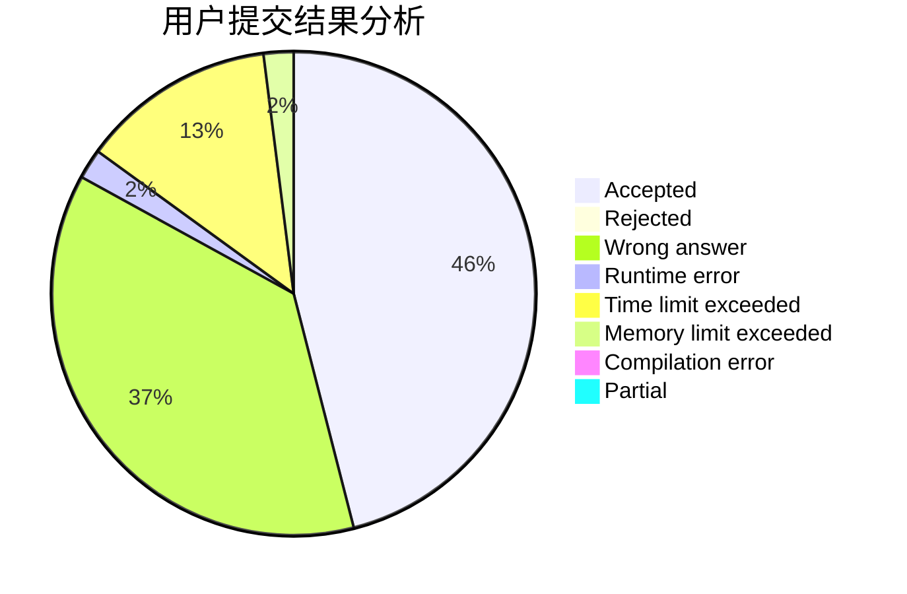
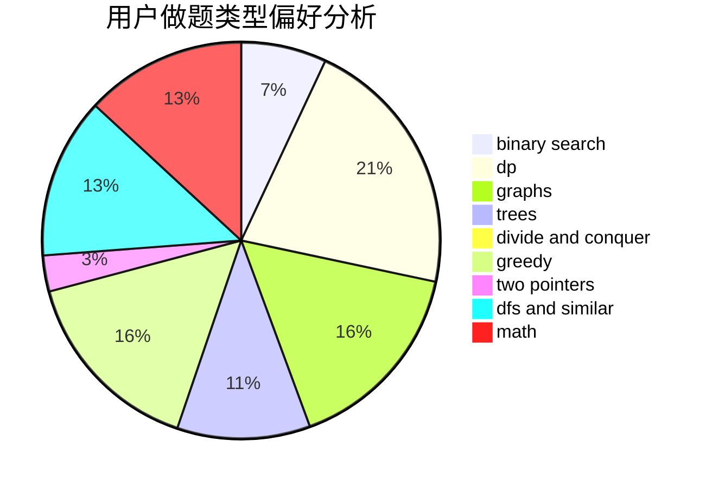

# jfy

<!-- tabs:start -->

#### **用户提交结果分析**

#### **用户做题类型偏好分析**

<!-- tabs:end -->
# 推荐题目
[896A](https://codeforces.com/contest/896/problem/A)
[659G](https://codeforces.com/contest/659/problem/G)
[1066F](https://codeforces.com/contest/1066/problem/F)
[940A](https://codeforces.com/contest/940/problem/A)
[584E](https://codeforces.com/contest/584/problem/E)
[258B](https://codeforces.com/contest/258/problem/B)
[1076A](https://codeforces.com/contest/1076/problem/A)
[343B](https://codeforces.com/contest/343/problem/B)
[1372F](https://codeforces.com/contest/1372/problem/F)
[1174D](https://codeforces.com/contest/1174/problem/D)
