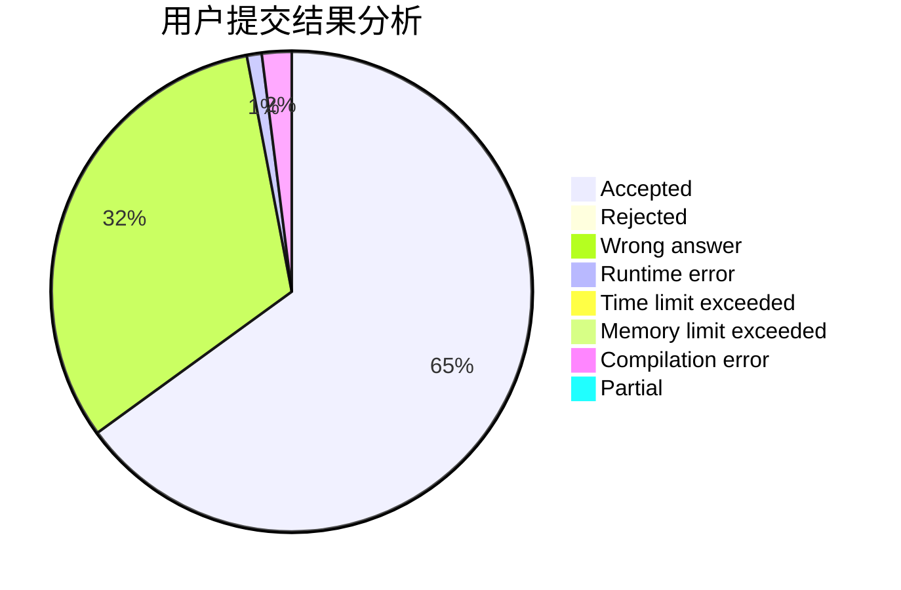
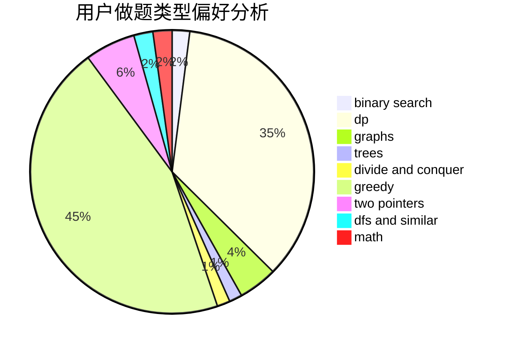

# jhdonghj112

<!-- tabs:start -->

#### **用户提交结果分析**

#### **用户做题类型偏好分析**

<!-- tabs:end -->
# 推荐题目
[1164M](https://codeforces.com/contest/1164/problem/M)
[1510A](https://codeforces.com/contest/1510/problem/A)
[1030G](https://codeforces.com/contest/1030/problem/G)
[779C](https://codeforces.com/contest/779/problem/C)
[1013E](https://codeforces.com/contest/1013/problem/E)
[574A](https://codeforces.com/contest/574/problem/A)
[846F](https://codeforces.com/contest/846/problem/F)
[772E](https://codeforces.com/contest/772/problem/E)
[215C](https://codeforces.com/contest/215/problem/C)
[746C](https://codeforces.com/contest/746/problem/C)
