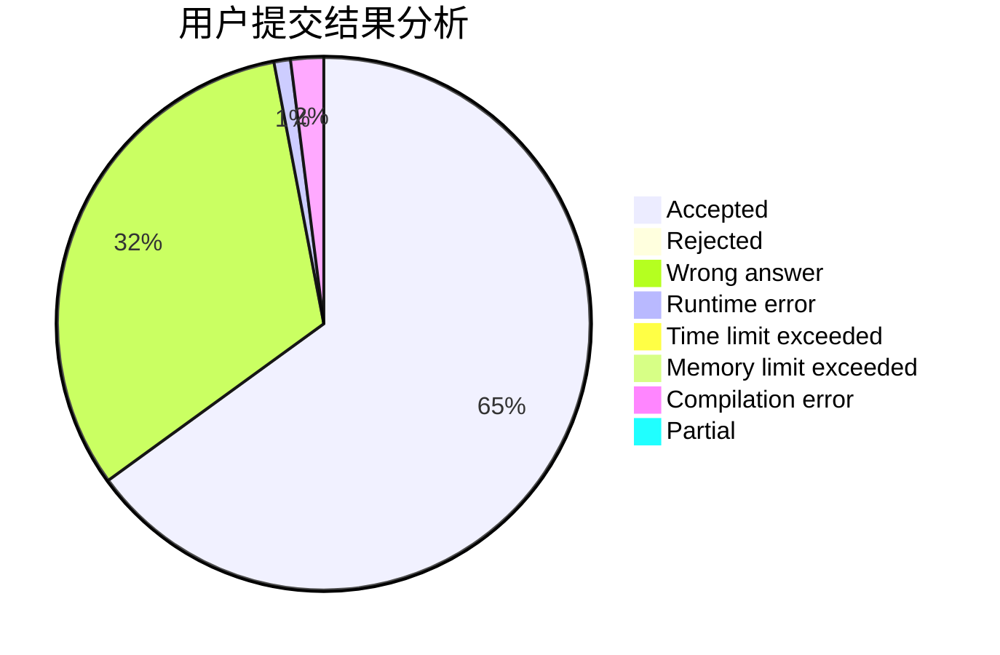
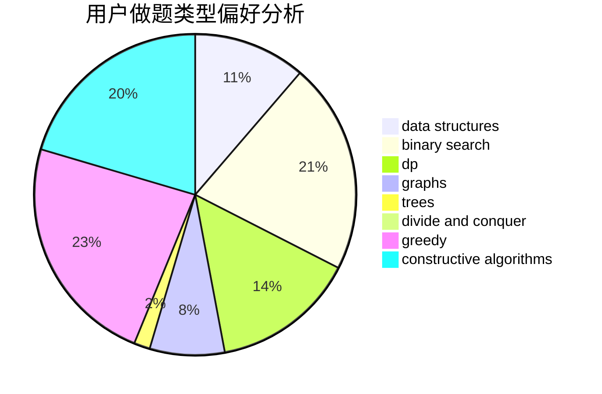
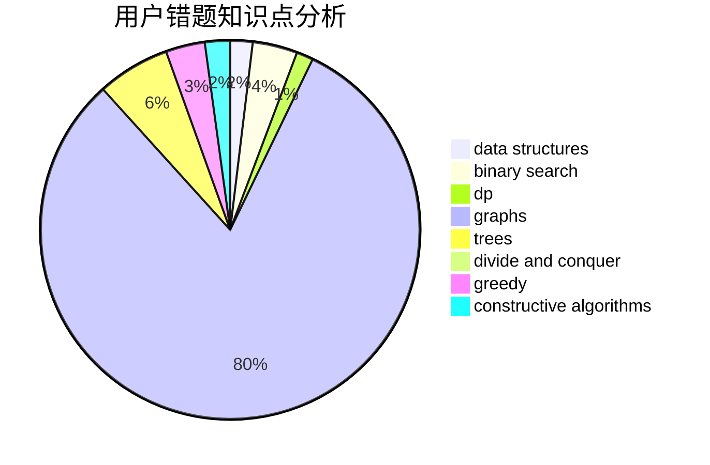

# jhdonghj112

<!-- tabs:start -->

#### **用户提交结果分析**

#### **用户做题类型偏好分析**

#### **用户错题知识点分析**

<!-- tabs:end -->
# 推荐题目
[1162E](https://codeforces.com/contest/1162/problem/E)		dsu,graphs,sortings,trees		  
[149E](https://codeforces.com/contest/149/problem/E)		string suffix structures,
                        strings		  
[1030C](https://codeforces.com/contest/1030/problem/C)		implementation		  
[759E](https://codeforces.com/contest/759/problem/E)		dsu,graphs,sortings,trees		  
[1013B](https://codeforces.com/contest/1013/problem/B)		greedy		  
[549B](https://codeforces.com/contest/549/problem/B)		constructive algorithms,
                        dfs and similar,
                        graphs,
                        greedy		  
[828C](https://codeforces.com/contest/828/problem/C)		dsu,graphs,sortings,trees		  
[754D](https://codeforces.com/contest/754/problem/D)		binary search,
                        data structures,
                        greedy,
                        sortings		  
[18E](https://codeforces.com/contest/18/problem/E)		dp		  
[729C](https://codeforces.com/contest/729/problem/C)		binary search,
                        greedy,
                        sortings		  
