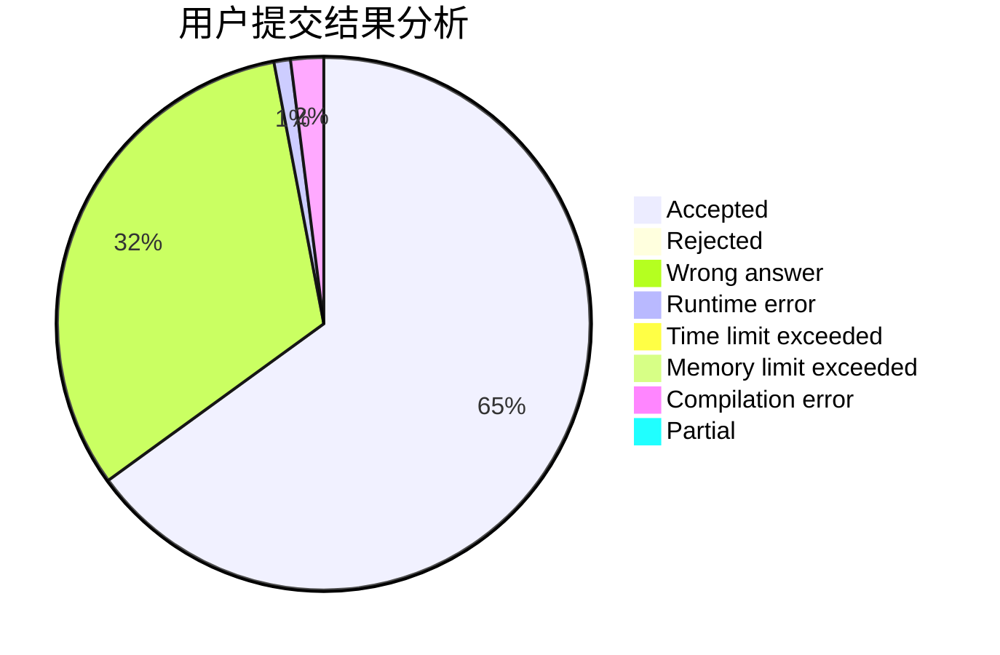
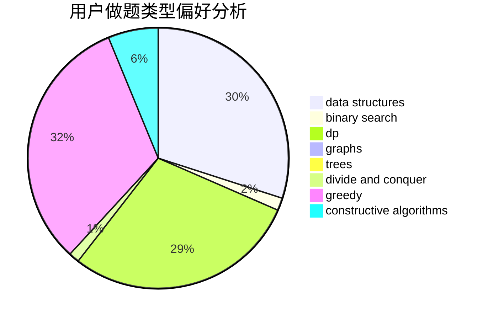
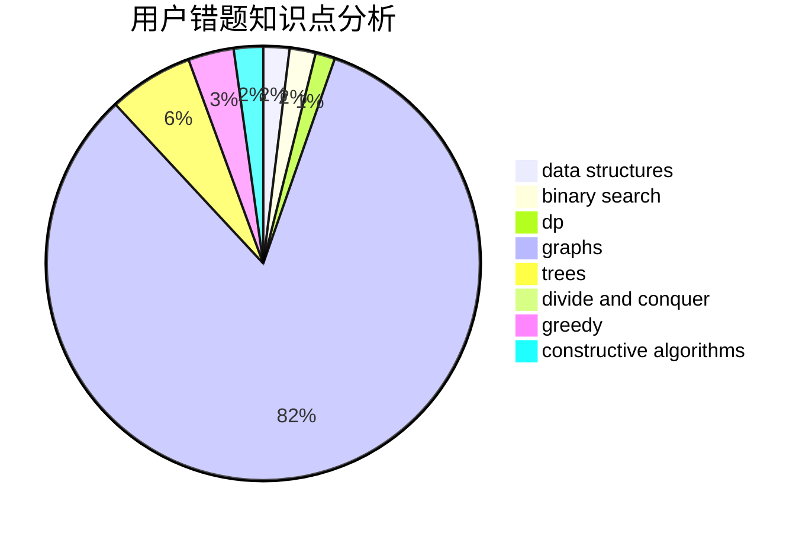

# jhdonghj112

<!-- tabs:start -->

#### **用户提交结果分析**

#### **用户做题类型偏好分析**

#### **用户错题知识点分析**

<!-- tabs:end -->
# 推荐题目
[1164M](https://codeforces.com/contest/1164/problem/M)		dsu,graphs,sortings,trees		  
[1510A](https://codeforces.com/contest/1510/problem/A)		nan		  
[1030G](https://codeforces.com/contest/1030/problem/G)		number theory		  
[779C](https://codeforces.com/contest/779/problem/C)		constructive algorithms,
                        greedy,
                        sortings		  
[1013E](https://codeforces.com/contest/1013/problem/E)		dsu,graphs,sortings,trees		  
[574A](https://codeforces.com/contest/574/problem/A)		greedy,
                        implementation		  
[846F](https://codeforces.com/contest/846/problem/F)		data structures,
                        math,
                        probabilities,
                        two pointers		  
[772E](https://codeforces.com/contest/772/problem/E)		binary search,
                        divide and conquer,
                        interactive,
                        trees		  
[215C](https://codeforces.com/contest/215/problem/C)		brute force,
                        implementation		  
[746C](https://codeforces.com/contest/746/problem/C)		constructive algorithms,
                        implementation,
                        math		  
