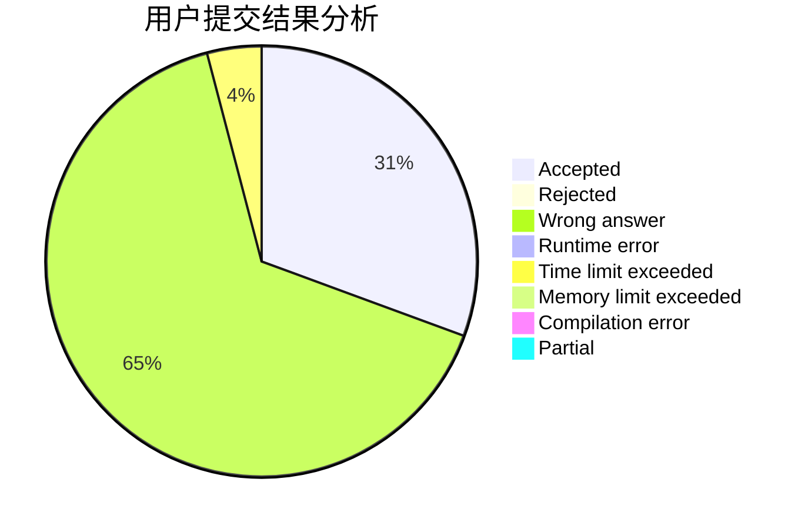
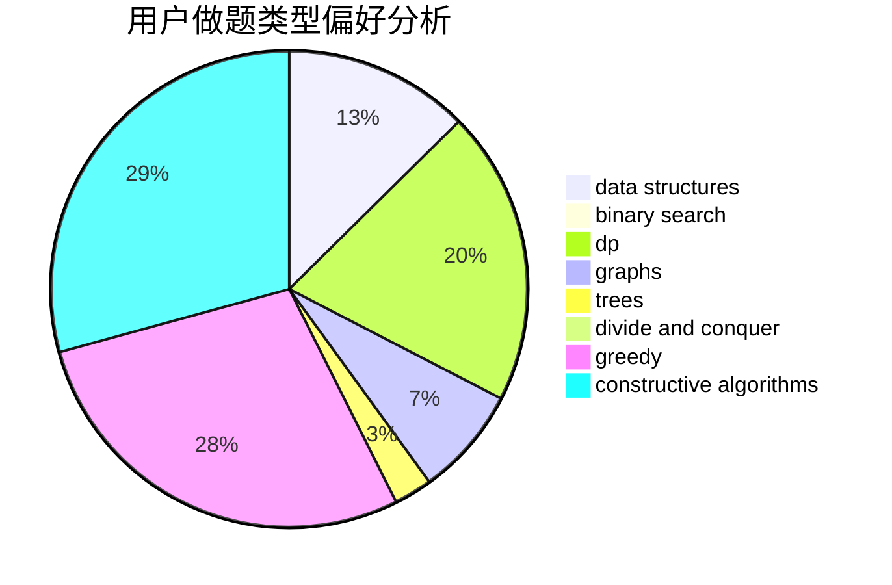

# jhknmj

<!-- tabs:start -->

#### **用户提交结果分析**

#### **用户做题类型偏好分析**

#### **用户错题知识点分析**

<!-- tabs:end -->
# 推荐题目
[1380C](https://codeforces.com/contest/1380/problem/C)		brute force,
                        dp,
                        greedy,
                        implementation,
                        sortings		  
[1156D](https://codeforces.com/contest/1156/problem/D)		dfs and similar,
                        divide and conquer,
                        dp,
                        dsu,
                        trees		  
[13573](https://codeforces.com/contest/1357/problem/3)		dsu,graphs,sortings,trees		  
[448B](https://codeforces.com/contest/448/problem/B)		implementation,
                        strings		  
[312A](https://codeforces.com/contest/312/problem/A)		implementation,
                        strings		  
[987A](https://codeforces.com/contest/987/problem/A)		implementation		  
[1228B](https://codeforces.com/contest/1228/problem/B)		implementation,
                        math		  
[689A](https://codeforces.com/contest/689/problem/A)		brute force,
                        constructive algorithms,
                        implementation		  
[1045C](https://codeforces.com/contest/1045/problem/C)		dfs and similar,
                        graphs,
                        trees		  
[354D](https://codeforces.com/contest/354/problem/D)		dp		  
