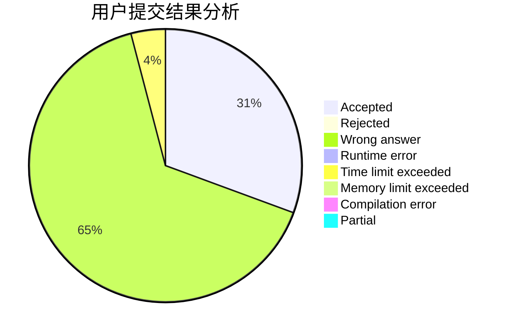
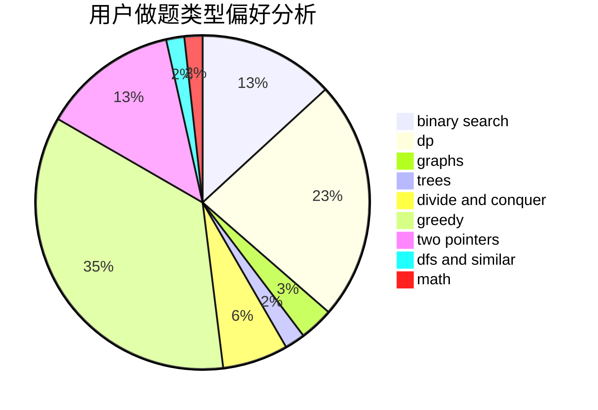

# jhknmj

<!-- tabs:start -->

#### **用户提交结果分析**

#### **用户做题类型偏好分析**

<!-- tabs:end -->
# 推荐题目
[1380C](https://codeforces.com/contest/1380/problem/C)
[1156D](https://codeforces.com/contest/1156/problem/D)
[13573](https://codeforces.com/contest/1357/problem/3)
[448B](https://codeforces.com/contest/448/problem/B)
[312A](https://codeforces.com/contest/312/problem/A)
[987A](https://codeforces.com/contest/987/problem/A)
[1228B](https://codeforces.com/contest/1228/problem/B)
[689A](https://codeforces.com/contest/689/problem/A)
[1045C](https://codeforces.com/contest/1045/problem/C)
[354D](https://codeforces.com/contest/354/problem/D)
