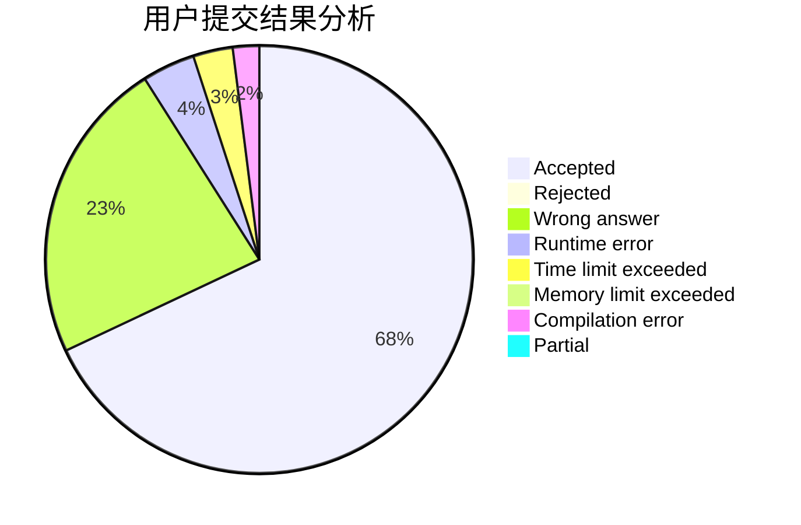
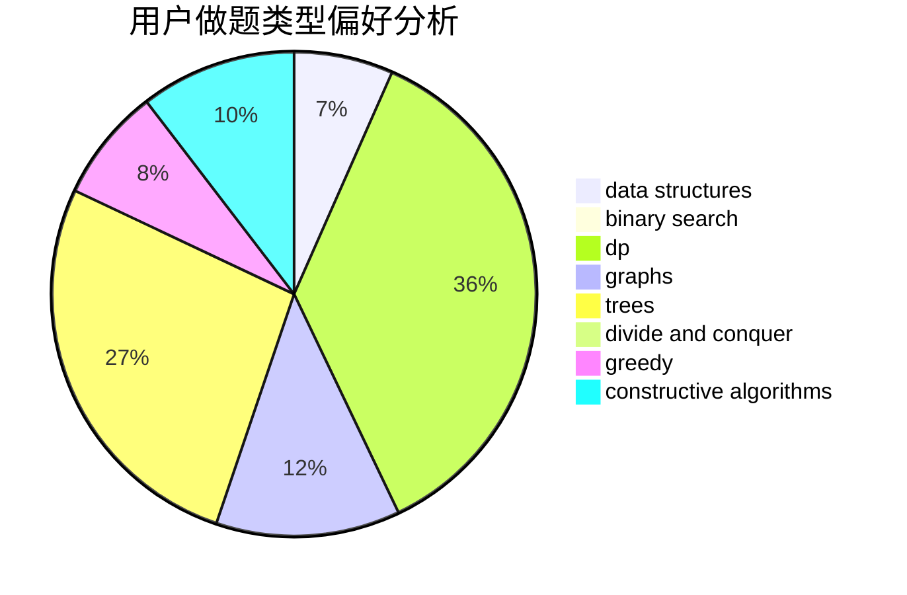

# jhzjk

<!-- tabs:start -->

#### **用户提交结果分析**

#### **用户做题类型偏好分析**

#### **用户错题知识点分析**

<!-- tabs:end -->
# 推荐题目
[1228B](https://codeforces.com/contest/1228/problem/B)		implementation,
                        math		  
[925F](https://codeforces.com/contest/925/problem/F)		binary search,
                        flows		  
[715A](https://codeforces.com/contest/715/problem/A)		constructive algorithms,
                        math		  
[1346E](https://codeforces.com/contest/1346/problem/E)		*special problem,
                        dp,
                        graphs		  
[1059D](https://codeforces.com/contest/1059/problem/D)		binary search,
                        geometry,
                        ternary search		  
[260A](https://codeforces.com/contest/260/problem/A)		implementation,
                        math		  
[737F](https://codeforces.com/contest/737/problem/F)		constructive algorithms,
                        math		  
[459B](https://codeforces.com/contest/459/problem/B)		combinatorics,
                        implementation,
                        sortings		  
[513A](https://codeforces.com/contest/513/problem/A)		constructive algorithms,
                        math		  
[1294D](https://codeforces.com/contest/1294/problem/D)		data structures,
                        greedy,
                        implementation,
                        math		  
